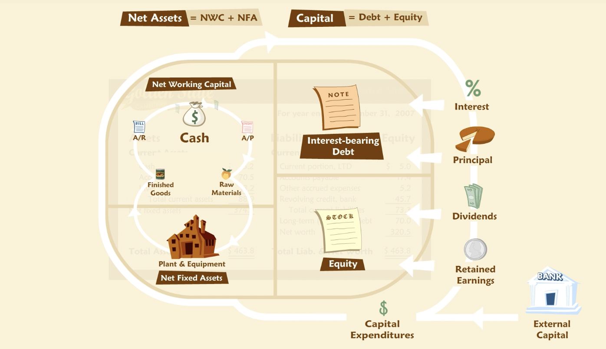

# Cash Cycle and Growth

- **"Even a profitable company will experience financial problems if it runs out of cash. This is especially true for companies that are growing quickly. Rapid growth creates a need for financing that, if not prudently met, can precipitate a crisis or, at a minimum, retard growth. One of the keys to managing growth from a financial perspective is the cash cycle."**

## Cash Cycle

- **"The cash cycle is sometimes called the operating or net working capital (NWC) cycle. It is a representation of the movement of cash through a cycle of operations. For example, the operating cycle of a wholesaler begins with the purchase of goods from a supplier, which is held as inventory until a customer purchases the goods, and eventually pays the wholesaler, who in turn pays the supplier. The order in which these events occur, and the length of time between them, drive the natural flow of cash in and out of the business. This operating cycle involves different steps, depending on the business being examined. That is, the operating cycle for a manufacturer will be different from that of a wholesaler or retailer, or a service company. Accordingly, the cash cycles for each will differ as well."**
- **"To some extent, the characteristics of the cash cycle are determined by fundamental properties of a given business. But managerial choices affect the cash cycle as well — for example, how much credit the company chooses to extend to its customers will lengthen or shorten the cycle."**

### Cash versus Profit

- **"Note that the cash cycle focuses on cash flow rather than profit. What is the difference? Profit is defined by accounting principles and rules that are not designed to track cash flow and consequently do not correspond to it."**
- **"Without cash flow, even a profitable company will go out of business. With it, even an unprofitable one may operate for a long time."**

### Inflows and Outflows

- **"Think of the cash cycle as reflecting a recurring set of activities. A company buys goods, sells them, collects cash, and uses the cash to buy more goods, sells them, and so forth. Every company has a cash cycle."**
- A basic cycle is reflected in changes that occur over time in the working capital accounts. 
- Over the course of a year this cycle may be repeated many times with many suppliers and customers, and in simultaneous or overlapping transactions.

### Illustration

- **"You might suppose that for a healthy business, the inflows and outflows that comprise the cash cycle will balance each other out, so there is nothing to worry about. Indeed, in the long run we would expect a profitable business to have greater inflows than outflows, and hence still less to worry about. But for most businesses, the outflows happen before the inflows."**

### Growth

- **"The simple fact that outflows precede inflows creates a need for financing of the basic working capital accounts. Sometimes this need for financing is simply referred to as a need for working capital."**
- **"Larger operations require more capital."**
- **"Growth will require even more capital. The higher the growth, the more capital is required. In effect, a growing firm is using cash collected from yesterday's sales to fund tomorrow's purchases. This causes a shortfall because a growing firm is bigger tomorrow than it was yesterday."**

### Extensions

- **"Net working capital — it represents the netting of liability accounts such as payables and accrued expenses against asset accounts such as inventory and receivables."**
- **"Let's embellish the cycle we examined above, first, by inserting a factory that converts raw materials into finished goods. Now we have three types of inventory: raw materials, work in process and finished goods. And, like the working capital accounts, our factory must appear on the balance sheet as a "property plant and equipment" or "fixed assets"."**
- **"overlaid on a stylized balance sheet. We'll put all the working capital accounts and the net fixed assets on the left side. On this balance sheet, even a liability, such as accounts payable, appears on the left side because it is part of working capital. In fact, this is what is connoted by the term "net working capital" — it represents the netting of liability accounts such as payables and accrued expenses against asset accounts such as inventory and receivables. In effect, we've put all the accounts relating to operations on the left side of our balance sheet."**
- **"What is on the other side? On the right side are all the ownership claims — debt and equity. In other words, the capital the company has raised to finance its operations. The balance sheet has to balance — the debt and equity together must equal the net working capital and net fixed assets together."**
- **"The basic cash cycle we examined above runs through the working capital accounts, which are now shown (on a net basis) as the upper left portion of the balance sheet. But now suppose the company is profitable — that is, goods are sold for well more than what it costs to make them — and that this generates more cash than is needed merely to pay suppliers. What happens to the extra cash? It is part of an extended cash cycle, using the whole balance sheet. Some cash will go to lenders in the form of interest and principal payments. Some may go to shareholders as dividends. Some will stay in the company and be reinvested in fixed assets, such as machinery."**
- **"The extended cash cycle may be fairly simple, as in the example just discussed, or fairly elaborate. For some companies, for example, it may include the issuance of new securities, which brings new cash into the firm from investors rather than customers. This new cash may be intended for further investment in working capital or fixed assets, or to finance losses — shortfalls in cash from operations perhaps from poor economic conditions or a startup phase of operations. We could further complicate the picture by adding taxes — a diversion of cash to the government. How simple or complicated a cycle we consider depends, first, on how complicated the company affairs are, and second, on why we are analyzing it."**

### Cash Conversion Cycle (CCC)

- **"The CCC combines three ratios: days in inventory, collection period, and payables period."**
- As for other financial ratios, CCC can be compared to past values, targets, or industry average.

### Seasonality

- **"Seasonality in operations causes predictable fluctuations in working capital accounts, including cash. To fund the seasonal peaks in working capital, many businesses rely on revolving credit. A revolving credit facility works a lot like consumer credit cards — the company may borrow up to some agreed-upon limit as necessary, and then repays the loan as its seasonal needs recede. This is similar to a consumer who uses credit cards to buy holiday gifts and then pays down the balance over the following months. A fee is charged by the bank for providing the line of credit, and interest is charged on the amount actually borrowed. Most revolving credit agreements impose further conditions, such as limits based on available collateral (usually receivables and inventory) and a requirement that the loan be completely paid off for some period during each year."**