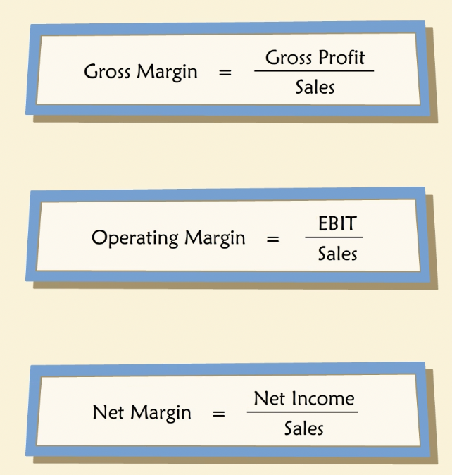
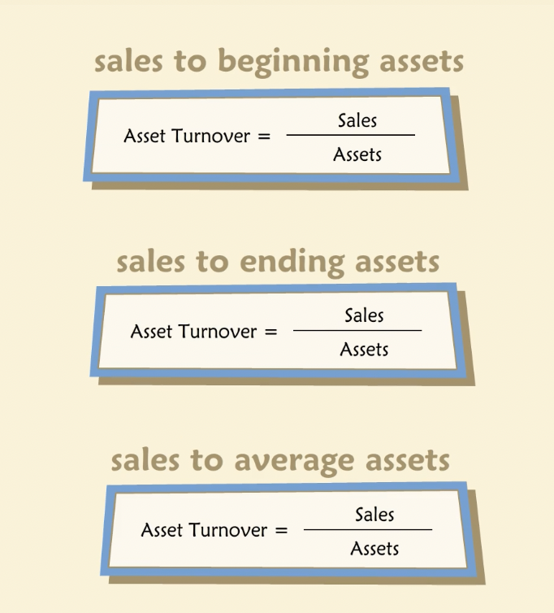
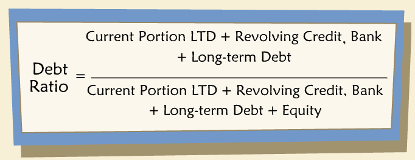

# Ratio Analysis

- The first step to analyze any business is to examine its recent performance and current financial condition.
- **"Finance professionals use a myriad of different financial ratios to assess financial health — so many, in fact, that it helps to group them into categories. Here are six basic categories:"**
  - Growth
  - Profitability
  - Liquidity
  - Leverage
  - Efficiency
  - Risk

```{warning}
Be aware that not everyone uses the same categories, and different analysts may define a given ratio differently.
```

## Definition

- **"Most financial ratios consist of a simple comparison between items of interest from a balance sheet and/or income statement that yield insight into condition or performance."**

## Growth

- **"More generally, investors and managers want their businesses to produce more cash, to become more valuable. In short, they are looking for growth. We usually measure growth as a rate of change over time in a specific item of interest, such as sales, assets, profits, or cash flow."**
- **"Historic growth rates may be an indicator of future growth potential."**

### Compound Average Growth Rate

- **"In addition to computing a company's year-to-year growth rates, we may be interested in average growth rates over a longer period. One way to measure this is to compute a compound average growth rate (CAGR). The CAGR is the single constant growth rate that, when compounded over a finite number of years, produces the observed end point from the observed starting value."**

### Operating Profits

- **"Operating profit is often referred to as earnings before interest and taxes (EBIT)."**

## Profitability

- **"In addition to knowing whether a company is growing, we want to know if it is profitable. We could simply look at gross profit, operating profit, and net income, to see if each is positive or negative. But that's not enough. It helps to compare profits to something. For example, how much sales were required to generate a given profit? How large an asset base was required? If we compare operating profit to sales, we get the operating margin. Comparing operating profit to assets is one way to measure pre-tax return on assets."**

### Profit Margins

- **"We can think of profit margins in a hierarchy in which each successive margin takes an additional factor into account."**

- By looking at different margins, we can learn more about the good and bad performance. 

### Return on Equity

- **"The return on beginning equity (ROBE) compares net income during a given year to owner's equity at the beginning of the year. ROBE is a popular measure of financial performance among investors and managers and will be discussed in greater detail in future chapters. Another common variant of this ratio is ROE, which compares net income during the year to end-of-year owner's equity."**

## Efficiency

- **"Many financial ratios are intended to help assess the efficiency of a company's operations. Some analysts call this category "Activity Ratios". For example, we may want to measure how well a business employs its plant and equipment, its inventory, its credit from suppliers, and so forth. Or we may want to know how quickly its receivables are collected or how long some products stay in inventory before a sale."**

### Asset Turnover

- Many efficiency ratios combine an item from the income statement with one from the balance sheet. Asset turnover is one such ratio.


### Inventory


- Another ratio is days in inventory. It expresses the amount of inventory held in terms of the number of days of COGS it represents.

- **"All else equal, we prefer a lower number of days in inventory, which corresponds to a higher inventory turnover. Higher turnover indicates a need for less inventory and correspondingly lower capital requirements to finance the inventory. But industries vary widely, and sometimes a company may be willing to carry more inventory if it furthers some other goal. For example, it may be possible to charge higher prices or reach more or better customers by carrying more inventory."**

### Seasonality and Cyclicality

- Due to seasonality, a business ratio may look different in different times of the year.
- Cyclicality comes from business cycles i.e. with expansion and recession for example. 
- Unlike seasonal patterns, the timing of cyclical patterns are difficult to predict.

## Liquidity

- **"For an asset, liquidity denotes "closeness to cash," or the ease with which the asset can be converted to cash without a loss of value. For an entire company, liquidity is associated with the company's ability to meet known near-term cash obligations and/or to cope with unexpected needs for cash."**
- **"Liquidity ratios provide an indication of a company's ability to pay or "liquidate" short-term obligations, generally, those falling due within one year. Illiquidity may have serious consequences if it results in default on debt obligations or if it impairs future access to credit. On the other hand, excessive liquidity may reflect poor asset utilization."**

### Current Ratio

- **"The most common measure of liquidity is the current ratio. The current ratio simply compares current assets to current liabilities. Current assets include cash, marketable securities, and working capital items that will turn into cash within one year. Current liabilities include amounts owed to suppliers, employees, lenders, and the government within a year. A low current ratio may be an early warning of future liquidity problems as near-term obligations come due in greater amounts than are covered by contemporaneous liquid assets."**


### Quick Ratio

- **"The quick ratio is like the current ratio, except that inventories are excluded from current assets as  inventory is generally considered less liquid than receivables (and it is certainly less liquid than cash)."**


## Leverage

- **"Financial leverage (sometimes called "gearing") is created when a company borrows money to fund its operations. Debt creates fixed financial charges, namely interest and principal payments, that make a company's net earnings and cash flow more volatile."**
- **"Managers and investors study leverage ratios to understand the extent to which the company has utilized its capacity for borrowing and to spot possible problems associated with over-borrowing. All leverage ratios compare some measure of fixed charges or fixed claims to the company's ability to pay fixed charges or to its collateral, or to its non-debt capital."**

### Debt Ratio

- **"One of the most common leverage ratios compares debt to capital, also commonly called the debt ratio."**
```{warning}
Be aware that "debt ratio" is a name applied to a variety of differently defined ratios — it is important to check the particular definition being used by a given analyst.
```

- **"Analysts use different definitions of "debt" in debt ratios, depending on their purpose. For example, sometimes debt is defined to equal total liabilities, that is, everything other than shareholders' equity. Alternatively, debt is sometimes taken to be only long-term debts such as mortgages, bonds and debentures, including their current portions. Yet another alternative is to define debt as equal to total liabilities excluding trade-related accounts such as accounts payable and accrued expenses."**
- **"Obviously, each of these definitions leads to a different calculated ratio, so it is important to understand how a particular calculation has defined debt, and it is important to be consistent when comparing companies or time periods."**

### Times Interest Earned

- **"The times interest earned ratio (also known as the "interest coverage ratio") is another measure of leverage. It examines the extent to which a company's earnings cover its interest payments. Sometimes this ratio is computed using cash flow instead of operating profit in the numerator."**


## Risk

- **"The future performance of a business is uncertain — it could be better or worse, depending on what happens in the world. We can think of this uncertainty as risk, and note that it varies across businesses and industries, so we would like to measure it."**

### Fixed to Variable Costs

- **"One indicator of operating risk is the ratio of fixed costs to variable costs in a company's operations. Variable costs vary directly with sales, while fixed costs remain constant regardless of higher or lower sales. Published financial statements seldom provide unambiguous separations or allocations of variable and fixed costs, though many companies perform such allocations internally, precisely as a means of understanding risk. All else equal, a higher proportion of fixed costs denotes higher operating risk. At the same time, it denotes the potential for economies of scale — the possibility of growing sales without increasing fixed costs, which translates into higher operating margins (this is known as "operating leverage")."**

- Fixed costs are assumed to be all of selling, general and administrative expenses (except sales commission).
- Variable costs are assumed to be all of all of cost of goods sold (except depreciation).
- 
