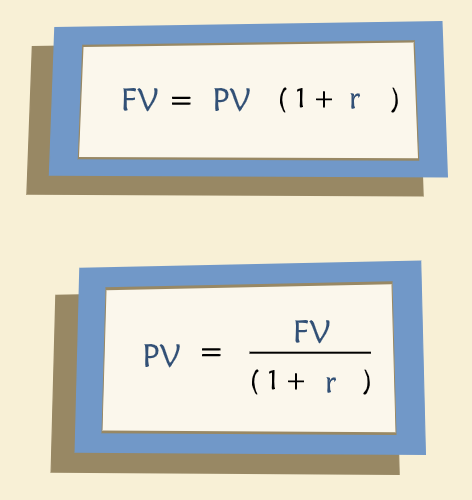
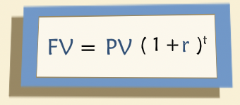
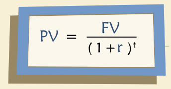
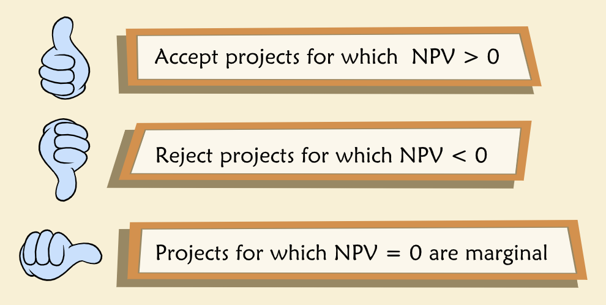
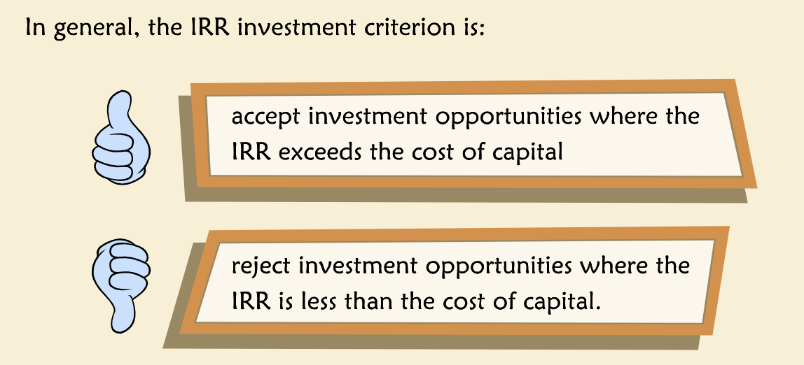
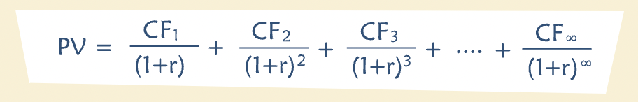
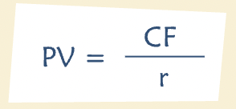
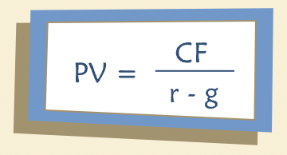

# Time Value of Money and Project Valuation

- **"Many corporate decisions involve considerations of value: how much is a business, a brand, a project, or a facility worth? Even more to the point, how much is it worth compared to what it costs? A common way to estimate value is to model the business or project as a stream of cash flows expected to occur over time, and to compute the present value of the stream. This general method is called discounted cash flow (DCF) analysis and it may be applied to many business situations."**

## Introduction

- **"The time value of money embodies the premise that a dollar today is worth more than a dollar tomorrow. A dollar not consumed today may be saved and invested. Consequently, a dollar invested today will be worth a dollar plus interest tomorrow. The time value of money is expressed by the following equation:"**

- **"FV stands for "Future Value", PV for "Present Value" and r for the market interest rate on a risk-free investment. For example, one dollar (the present value) invested today in a risk-free security that pays a 5% percent annual interest rate will give you $1.05 next year (the future value). Rearranging this expression leads to the fundamental discounted cash flow relationship."**

## Compounding and Discounting

- **"If we know present value we can always convert it to future value by a process called "compounding". Compounding is the mathematical computation of how much interest will be earned in the first year, then in the second year, including interest on interest, and so forth for as long as the investment is outstanding."**

- **"Discounting is simply the reverse of compounding. When compounding you begin with a present value and turn it into a future value by multiplying by (1 + r) for as many years as necessary. When discounting, you begin with a known future value and you compute an equivalent present value, now dividing by (1 + r)."**

### PV of a Cash Flow Stream

## Investment Decision Criteria

### Net Present Value

- **"Opportunity cost  is value we must give up in exchange for operation."**
- **"The Net Present Value (NPV) of the project is its present value minus the investment required to undertake it."**
- **"More generally, NPV is the difference between how much a project is worth (the PV) and how much it costs (the investment). When NPV is greater than 0, the project is worth more than it costs and conversely when NPV is less than 0, the project costs more than it's worth. Accordingly, a project's NPV is the amount by which wealth or firm value increases or decreases if you undertake the project."**
- **"Invest in all projects for which NPV is greater than 0."**

- Where, $CF_t$ is cash flow at time period $t$, $r$ is the discount factor for period $t$, $C_0$ is the cost of the project or the investment required to undertake it.
- **"In real business situations, the calculations on which NPV rests may be very complex, and inputs are estimated with varying degrees of confidence. Sometimes pertinent considerations are left out of the present value calculations, simply because they are too difficult to quantify. Consequently, some firms use NPV as in important, but not decisive or exclusive, consideration in their decisions about investment opportunities. And many firms supplement it with other calculations and criteria."**

### Payback Period

- **"The payback period is defined as the time it takes to recoup the original investment in a project. All else being equal, companies prefer shorter payback periods due to the time value of money and, perhaps, because of risk considerations."**
- **"Computing the payback period is usually straightforward after incremental cash flows have been estimated. One simply computes the accumulated cash flow for each year, beginning in year zero and compares the accumulated cash flow to the initial investment. The payback period is the point in time at which accumulated cash flow equals the initial outlay."**
- **"The main advantage of the payback period calculation is its simplicity. Unfortunately, it includes no formal treatment of the time value of money. Perhaps even more seriously, it ignores all cash flows beyond the payback period. So a project with a very large, but somewhat distant, payoff is not treated kindly by this calculation."**

#### Discounted Payback Period

- **"A variation on payback period is Discounted Payback Period. The difference is that instead of using cumulative cash flow to calculate the payback, one uses cumulative discounted cash flow. This variation considers the time value of money, but still ignores cash flow beyond the payback horizon."**

### Internal Rate of Return

- **"The IRR is defined as the discount rate at which the NPV of an investment equals zero. To use IRR as an investment criterion, one compares it to the cost of capital. Typically, projects for which IRR exceeds the cost of capital are projects for which NPV>0."**

## Perpetuities

- **"A perpetuity is a stream of cash flows that occur at regular intervals and last forever."**
- **"What is the present value of a perpetuity? To calculate it, add up the present values of all the cash flows at a discount rate of r."**

- Where "CF" is the amount of cash generated each year, beginning in year one, and r is the discount rate.

### Growing Perpetuities

- **"The formulae above assume the cash flow remains constant. There is a similarly simple formula for the present value of a perpetuity where the cash flows grow at a constant rate, g, every year. The formula is:"**

- Where CF is the initial cash flow, r is the discount rate and g is the constant growth rate of the cash flows.
- **"It is important to note that the growth rate, g, must be less than the discount rate, r. Fortunately, this is not an unreasonable condition to impose — no company, indeed no economy, can produce a cash flow that grows faster than the discount rate forever."**
