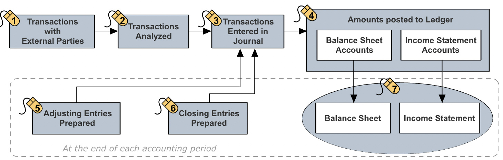
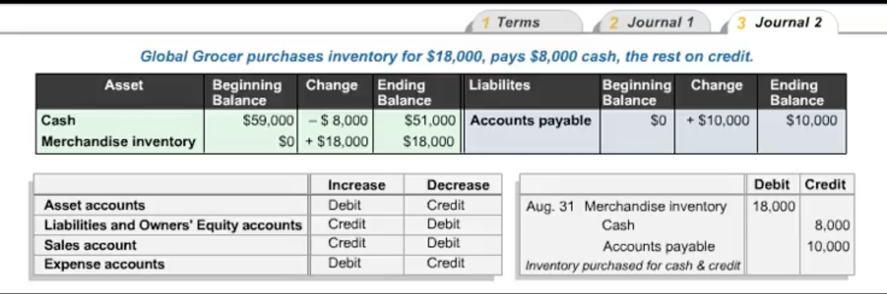
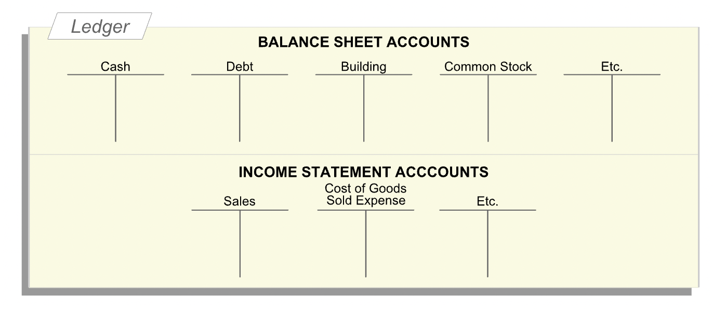
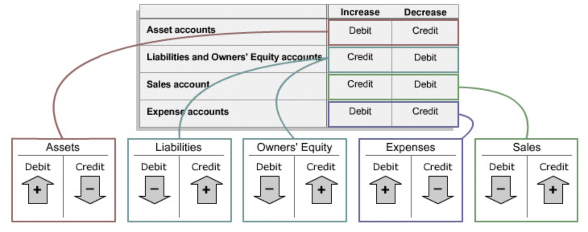

# Accounting Records

## Overview

- **"In any accounting system, a series of systematic steps help the entity and its accountants track and record its financial activities during an accounting period and to prepare the desired financial statements at the end of the period."**

## Double-Entry Accounting

- **"A double-entry accounting system records the dual effects of each financial transaction. Each transaction affects at least two accounts."**
- **"Consider a transaction you have already encountered: raising $80,000 cash by issuing common stock, entity's first transaction. Entity recieved cash and issued common stock. Account analysis indicates that two accounts were affected by this transaction: the cash account and the common stock account. The financial accounting system, a double-entry system, recorded an increase of $80,000 in the cash account and an increase of $80,000 in the common stock account. This is how we recorded the transaction when it occurred."**

## Journal Entries

- **"When a transaction occurs and has been analyzed, an entry has to be made in the journal. The journal is a chronological record of the entity's transactions."**

### Debit and Credit

- **"Each change to an account consists of a dollar amount and a direction (whether it is an increase or a decrease). In accounting, we indicate the direction of the change by a specialized use of the words debit and credit. While learning financial accounting, you should forget day-to-day meanings of the words debit and credit."**

- **"After analyzing a transaction, a journal entry is prepared using the rule that debits indicate increases in assets and in expenses and credits indicate increases in liabilities, owners' equity and sales."**
- 

## Ledger

- **"After a journal entry has been made, it is posted to the ledger, which contains T-accounts, one for each account. Accountants use T-accounts as an aid to double-entry bookkeeping, one that helps track changes (debits and credits) to different accounts, and when used correctly, ensures that the basic accounting equation holds after each transaction."**

### T-Accounts

- **"Each T-account is associated with a single account, such as Cash, Accounts Payable, Common Stock or Sales. The T-account is literally a large 'T' with an account name on top. The left side of the T-account is the debit side. The right side of the T-account is the credit side. So, in financial accounting, debit means left side, and credit means right side."**
- **"At any given time, each account has a balance (the monetary amount in that account). An account may have a debit (left-side) or a credit (right-side) balance."**
- **"Combining the journal-related use of debit and credit with their ledger-related meanings, immediately tells us how to post journal entries to the ledger. For asset accounts, increases are recorded on the debit side or the left side of the T-account. Decreases in asset accounts are recorded on the credit or the right side of the T-account."**
- **"For liability and owners' equity accounts, decreases are recorded on the debit or the left side of each T-account. Increases in liability and owners' equity accounts are recorded on the credit or right side of the T-account."**
- **"Increases in sales are recorded as credits and increases in expenses are recorded as debits."**

## Adjusting Entries

- **"in accrual accounting, at the end of each accounting period, a number of adjusting entries have to be made. These transactions, which do not involve any external parties, represent expenses that are not associated with either the goods or services sold during the period or with future revenues. They must therefore be recorded in the current period."**

## Closing Entries

- **"Now it is time to close out each temporary or income statement account and reset it to a zero balance, in preparation for the next accounting period. Notice that the sales account has a credit balance, and all the expense accounts have debit balances."**
- Closing entries are required to close income statement account.
- **"After closing out the income statement (temporary) accounts, the balances in the ledger's balance sheet (permanent) accounts are transferred to the balance sheet at the end of the period."**
- **"The closing entry shows the balances in all the income statement accounts just before they were closed, and hence provides the information needed to prepare the income statement of the period."**
