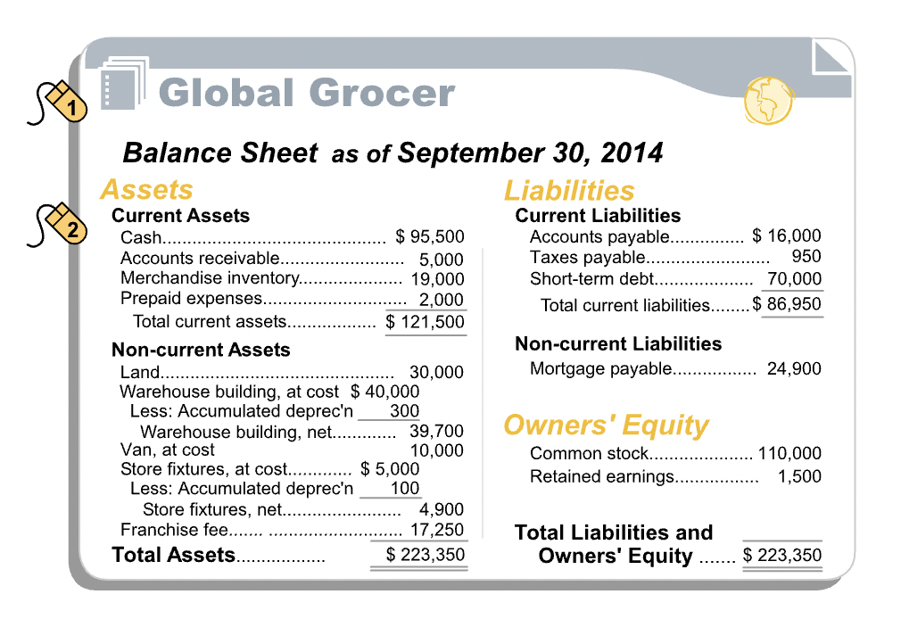
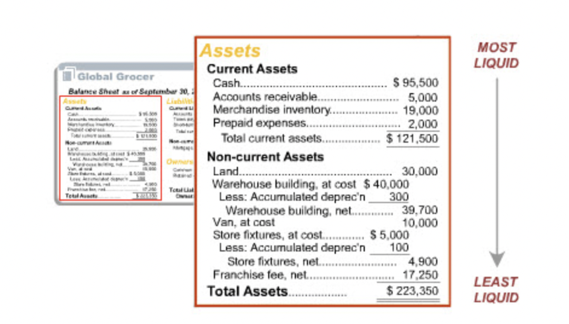
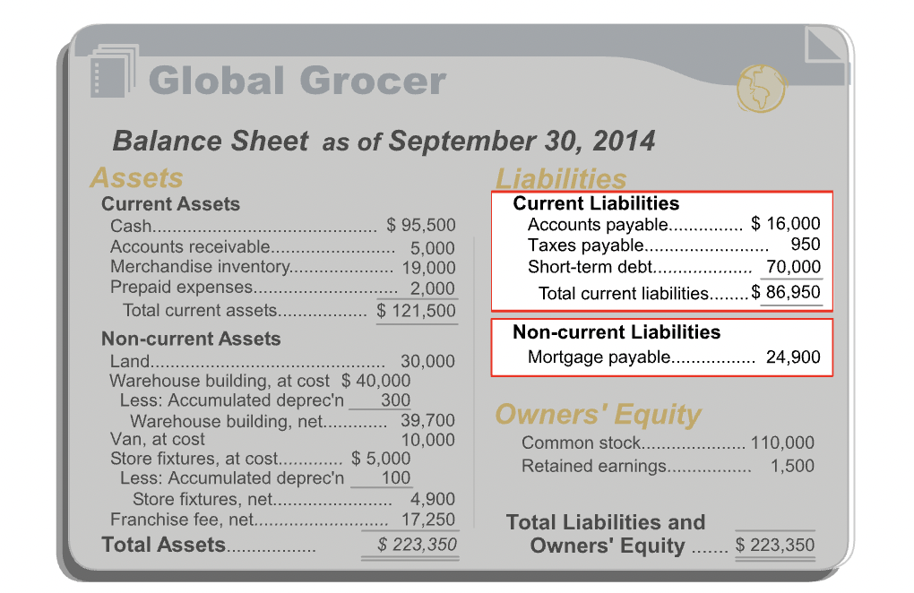
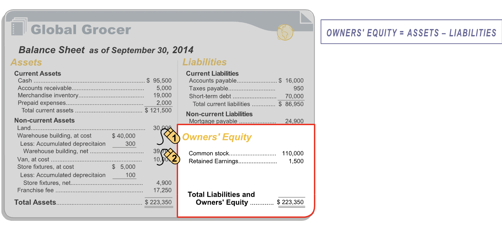
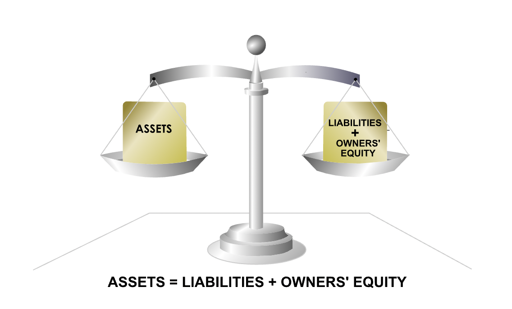

# The Balance Sheet

## Layout

- **"The balance sheet, also known as a statement of financial position, is a snapshot at a specific point in time, of the resources controlled by an entity (assets), the claims against those resources (liabilities), and the owners' residual interest in the entity (owners' equity). In the side-by-side format shown, assets are listed on the left side of the balance sheet; liabilities and owners' equity are listed on the right."**

## Assets

- **"Left-hand side of the balance sheet lists the asset accounts, which represent the economic resources of the firm. To be recorded as an asset, an economic resource must meet four requirements:"**
  - Acquired at measurable cost
  - Obtained or controlled by the entity
  - Expected to produce future economic benefits
  - Arises from a past transaction or event

### Tangibility

- **"An item can be an asset whether or not it has physical substance, i.e., whether or not it can be touched and felt. Assets like computers and buildings having physical substance are tangible assets. Other assets, like licenses and prepaid expenses that lack physical substance, are intangible assets."**

### Liquidity

- **"On the balance sheet, assets are organized into two categories: current and non-current. Current assets include cash and those assets that are expected to be converted into cash or consumed within 12 months of the balance sheet date. Non-current assets are assets that are expected to provide economic benefits for periods longer than a year."**
- **"Some tangible, non-current assets with limited lives, such as the warehouse building, have an associated contra-asset account, called accumulated depreciation, that reduces the recorded value of the asset."**

## Liabilities

- **". A liability represents an obligation of the entity to other parties. To be recorded as a liability, an obligation must meet three requirements:"**
  - It involves a probable future sacrifice of economic resources by the entity
  - The economic resource transfer is to another entity
  - The future sacrifice is a present obligation, arising from a past transaction or event

### Liability Types

- **"Liabilities are organized into two categories: current and non-current. Current liabilities are obligations that are expected to become due within 12 months of the balance sheet date. Non-current liabilities are obligations that are expected to become due more than 12 months past the balance sheet date."**

## Owner's Equity

- **"Owners' Equity is the residual interest of the entity's owners in the company's assets. It is the amount remaining after liabilities are deducted from assets."**

## The Accounting Equation

- **"A simple relationship connects assets, liabilities and owners' equity. The key feature of a balance sheet is that total assets is always equal to total liabilities plus owners' equity. This relationship between assets and liabilities plus owners' equity is known as the fundamental accounting equation."**
- **"The left side of the accounting equation--total assets--represents all of an entity's resources that have probable future economic benefits that the entity has obtained or controls as a result of past transactions or events. The right side of the equation--total liabilities plus owners' equity--represents the sources for those resources. Therefore, the two sides must be equal at all times."**
- $ASSETS = LIABILITIES + OWNER'S\_EQUITY$

## Concepts

- Dual aspect and historical cost concept are particularly relevant to the balance sheet. These two concepts provide guidance on the valuation of assets, liabilities and owners' equity.

### Dual Aspect

- **"The dual-aspect concept formalizes the idea that there are two sides to every accounting transaction. Recording both sides of each transaction is known as double-entry bookkeeping."**
- **"The dual-aspect concept has a very important implication: after both sides of each accounting transaction are recorded on the entity's books, the basic accounting equation should remain balanced."**
- Example, suppose an entity buys merchandise on credit. This transaction will be recorded in both assets as well as liabilities.

### Historical Cost

- **"The historical cost concept, also known as the cost concept, provides guidance as to the amount at which a transaction should be reported initially in the entity's accounts. It requires that transactions be recorded in terms of their actual price or cost at the time the transaction occurred."**
- Example, entity is planning to buy a warehouse property. The historical cost concept directs you to record the warehouse property at its acquisition cost of $70,000. Others may think the warehouse property is worth more or less than the amount Global Grocer paid, but their views are irrelevant. The accounting records will record the warehouse transaction initially at the amount actually paid for it.

#### Relevance / Reliability

- **"The historical cost concept provides a degree of reliability in the entity's accounts. It allows the accountant to ignore opinion and hearsay about the monetary value of items, and to report amounts based on actual transactions. But, the use of the historical cost concept also means that some amounts on an entity's balance sheet are based on historical values, determined at the time of purchase, which could predate the current balance sheet date by years. Consequently, it is unlikely that the asset amounts on the balance sheet reflect the value that the assets would fetch if they were sold today. In this sense, the financial statements may be 'less relevant' for the purposes of users of the entity's balance sheets, than if current market prices were reported."**
- **"As noted earlier, when relevance and reliability have to be traded off, financial reporting practice tends to favor reliability. Hence reliance on the historical cost concept may sometimes yield more reliable but less relevant financial information."**
- **"many monetary assets are recorded initially at their cost, and subsequently measured and reported in the balance sheet at their market value. Monetary assets are items such as marketable securities. Their market value can generally be estimated reasonably reliably."**
- **"While IFRS favors the historical cost model, it does present as an acceptable alternative treatment the revaluation of land and buildings to their market value, if their value can be measured reliably subsequent to their initial recognition at cost."**

## Ratios

- **"Users of financial statements use a technique known as financial ratio analysis to assess the financial position and performance of an entity. Financial ratios are ratios based on the amounts in the financial statements. Two simple balance-sheet-based ratios are introduced in this section. They are the current ratio and the long-term-debt-to-equity ratio."**

### Current Ratio

- **"An entity's ability to meet its current obligations - those due within the coming year - is an important measure of its financial health. These short-term obligations are usually repaid in the normal course of business, as the entity's current assets are converted to cash. For example, cash is generated when merchandise inventory is sold for cash, or when accounts receivables are collected in cash from customers. This cash can then be used to pay accounts payable."**
- **"The current ratio, or ratio of current assets to current liabilities, is a measure of an entity's ability to meet its maturing short-term obligations."**
- **"In the current ratio, the numerator, current assets, represents the resources of the entity that are either cash or expected to soon be converted into cash. Cash and these asset conversions to cash can be used to satisfy the immediate claims of short-term creditors. The denominator, current liabilities, represents the current claims of creditors that must be extinguished in the near-term."**

#### Interpretation

- **"While there is no single ideal current ratio, financial statement users often employ the rule-of-thumb that a healthy business will have a minimum current ratio of 2. Because the appropriate current ratio varies by industries, financial statement users tend to focus on an entity's current ratio relative to those of other, similar businesses. In the U.S., the pharmaceutical industry has had an average current ratio of 1.8 over the past decade; the software industry, on the other hand, has had a 2.9 average current ratio over the same time period. Software companies, with their limited need for fixed assets, traditionally hold a much larger proportion of their assets in cash and monetary current assets, and this is reflected in their significantly higher current ratios."**
- **"If financial statement users notice that an entity has a current ratio that is significantly higher than that of its peers, they may be concerned that the entity holds more cash or inventory than a business needs. This may signal that it is locking up potentially productive capital. If, on the other hand, an entity has current ratio that is significantly lower than that of its peers, financial statement users may question its ability to satisfy its current obligations in a timely manner."**

### Total Debt to Equity Ratio

- **"The composition of a company's long-term capital structure - primarily its total interest-bearing debt and owners' equity - is of interest to financial statement users seeking to assess the long-term financial viability of an entity. Of particular interest is the ratio of total debt (capital that accrues interest and has to be repaid to lenders) to equity capital (capital that does not demand interest and does not have to be repaid)."**
- **"The total debt to equity ratio is useful for judging an entity's long-term financial viability. As the name suggests, it is the ratio of all interest bearing debt on the balance sheet to total equity. This ratio measures financial leverage or the degree of the entity's indebtedness relative to its equity funding."**
- **"Debt and equity are very different kinds of capital. When an entity assumes debt, i.e., accepts a loan, it has to pay interest and also repay the loan to the debt holder over an agreed-upon period of time. If the entity runs into hard times and fails to pay its maturing financial obligations to its debt holders, they can force the entity into bankruptcy. Equity capital, on the other hand, is a residual claim on the entity's assets. If a company becomes insolvent, equity holders get what remains after debt-holders have been satisfied."**
- **"So, the larger the size of an entity's debt obligations relative to equity, i.e., the larger its total debt to equity ratio, the greater is the implied strain on the entity to make regular payments to debt holders, and the higher is the risk of bankruptcy."**

#### Interpretation

- **"There is no single ideal total debt to equity ratio. Over the past couple of decades, in the U.S., the average total debt to equity ratio for public companies has ranged from 0.5 to 1.0. However, it can vary considerably from one industry to another. Businesses in stable industries with tangible assets that make good collateral tend to borrow heavily to finance those investments, so they tend to have high total debt to equity ratios. In contrast, volatile businesses with few tangible assets tend to have low total debt to equity ratios. In the U.S., the software industry, which traditionally holds very little debt, has had a 0.10 average total debt to equity ratio over the past decade. On the other hand, financial firms, which traditionally are very highly leveraged, have had a total debt to equity ratio of 3.3 over the same time period."**
- **"If a company has a total debt to equity ratio that is significantly higher than that of its peers, financial statement users may be concerned about its ability to make the required payments to its debt holders and the company's long-term solvency may be questioned."**
- **"If, on the other hand, a company has a total debt to equity ratio that is significantly lower than that of its peers, financial statement users may question whether the company is being aggressive enough in pursuing profitable growth opportunities by raising debt when necessary to finance those opportunities."**
- **"As with other financial ratios, there is no single perfect total debt to equity ratio for any business. What is important is a company's total debt to equity ratio relative to those of other, similar businesses, and also how the ratio changes over time."**
- 