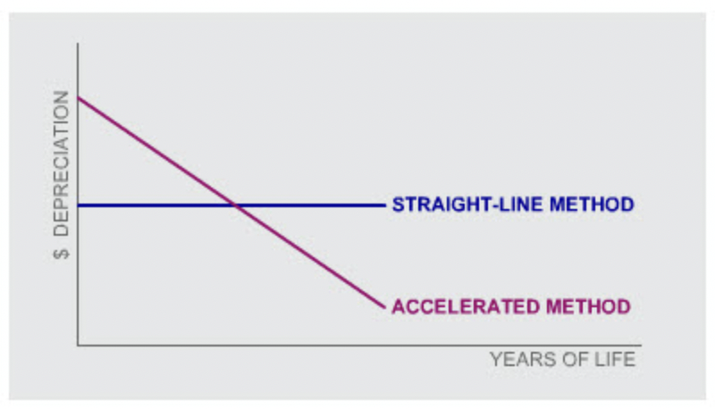
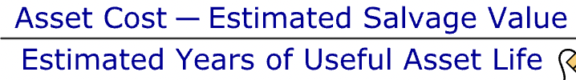
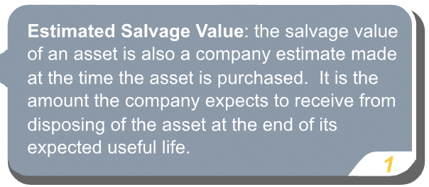
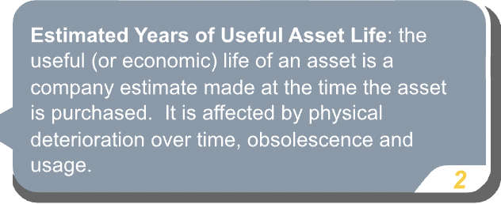
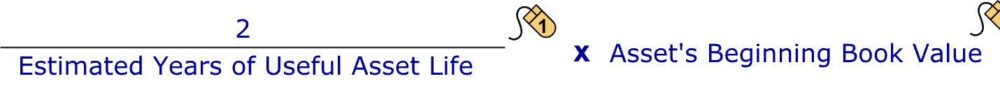
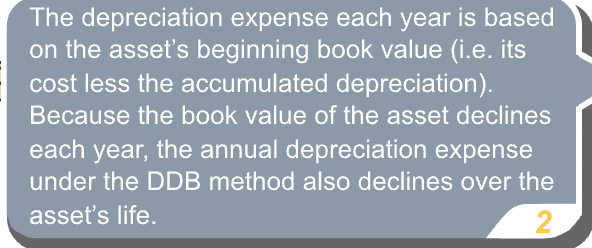
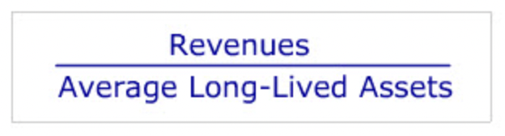

# Depreciation and Non-Current Assets

## What's an asset?

- **"To be called an "asset" a resource has to meet four criteria. It has to be:"**
  - acquired at a measurable cost
  - obtained or controlled by the entity
  - expected to produce future economic benefits
  - the result of a past transaction or event
- **"These four criteria apply equally to current assets and to long-lived assets. Long-lived assets differ from current assets in that they are expected to provide economic benefits beyond one year, whereas, current assets are generally consumed or converted into cash within a year."**

## Categories

- **"Long-lived assets fall into one of two categories: tangible assets and intangible assets. Tangible assets can be seen or touched, whereas intangible assets are, as the name indicates, without physical substance."**
- **"Examples of tangible assets are land, building, fixtures, equipment, and natural resources used in production such as a mine, fish reserve, or timber lands."**
- **"Examples of intangible assets are patents, copyrights, franchise licenses, and trademarks. Some intangible assets are referred to as "intellectual property"."**
- **"The accounting for long-lived non-monetary assets follows the historical cost concept. Under the historical cost concept, long-lived non-monetary assets are recorded initially at their cost, which is then allocated using a depreciation method to the periods during which the asset is used in business."**

## Acquisition Cost

### Capitalization

- **"The acquisition of a fixed asset, is often referred to as a capital investment. Costs associated with the acquisition of the asset that are incurred in bringing the asset to its intended location and to get it ready for use are "capitalized", i.e. included as part of the total cost of the asset that appears on the balance sheet."**
- **"If the acquired asset is land, the realtor's fee and the cost of clearing or preparing the land for construction are capitalized and included in the total cost. If the acquired asset is machinery, the cost of delivery, installation and, if necessary, the trial runs are all capitalized."**

## Asset Usage

- **"The cost of usage is called depreciation."**

## Depreciation

- **"As an asset loses its ability to produce future economic benefits for the company, it is said to be "depreciating". This loss of future ability to produce benefits represents a cost to the company which is recognized over the useful life of the asset. In accordance with the matching principle, in each accounting period a depreciation expense, based on the asset's original cost, is recorded as an expense in the income statement."**
- Contra-asset account is the account with the asset section of the balance sheet that normally has a credit balance rather than a debit balance. A contra-asset account is associated with a particular asset and is subtracted from the debit balance of the asset account. The contra-asset account appears with its related asset in the balance sheet, but it is the net balance (after subtracting the balance in the contra-asset account) which is shown in the totals column. 

### Methods

- **"Managers are permitted to use a number of different methods to determine a firm's periodic depreciation cost. GAAP requires the depreciation method adopted be systematic and rational. IFRS requires the depreciation method adopted reflect the pattern in which the asset's future economic benefits are expected to be consumed by the reporting entity."**
- **"The main methods used in practice are:"**
  - **"Straight-Line Depreciation: Under the "straight-line" method, the depreciation expense for a given long-lived asset is the same dollar value for each period of the asset's useful life. Straight-line depreciation is the most commonly used method of depreciation. It has the advantage of being simple and a good approximation for most situations. It assumes an assets ability to produce future economic benefits is used up at a constant rate over its life, which is a reasonable assumption for many assets."**
  - **"Accelerated Depreciation: The ability of some assets to produce future economic benefits is used up at a declining rate over their life. The "accelerated depreciation" method has been developed to allow for a "front-loaded" usage pattern, where the periodic depreciation expense declines steadily over the asset's useful life."**

#### Straight Line Method

- **"Under the straight-line method, the annual depreciation expense for an asset is estimated as follows:"**

- **"After several years of using an asset, a company may revise its estimates of the asset's useful life and salvage value. It can change these estimates and re-estimate the depreciation expense for the asset going forward. But it may not revise the depreciation expense or accumulated depreciation recorded in prior years."**

#### Accelerated Methods

- **"The most commonly-used accelerated depreciation method is the double-declining balance (DDB) method. Under the DDB method, the annual depreciation expense is estimated as follows:"**

- **"Notice that, in contrast to the straight-line method, DDB depreciation does not directly allow for an asset's expected salvage value. Instead, the asset continues to be depreciated until its book value equals its salvage value, at which point no further depreciation expense is recorded."**
- **"In the US since 1981, tax regulation has made it possible for companies to use an alternative accelerated depreciation method for tax purposes which allows them to depreciate their assets even more rapidly than under traditional accounting methods. The objective of the legislation was to stimulate corporate investment. In many cases, companies today keep two separate sets of depreciation schedules for their assets - one for tax purposes and one for financial reporting purposes."**

### Accounting

- **"For assets such as the packaging machine, which are used to manufacture the firm's products, the depreciation expense is charged to Work-Process Inventory as a product cost and subsequently transferred to Finished Goods Inventory and eventually to Cost of Sales."**

#### IFRS Allowed Alternative

- **"Under an IFRS allowed alternative to the cost method, IFRS permitted property, plant and equipment after initially being recorded at cost to be measured at its market value. Generally, any subsequent change in the asset's market value is recorded in other comprehensive income."**

## Improvements/Repairs

- **"The cost of any improvements or "betterment" to an existing asset must be capitalized. A betterment makes the existing asset better than it was when it was purchased and/or extends its life. It is recorded as an increase in the value of the existing long-lived asset."**
- **"Betterments are not the same as repair or maintenance costs which are incurred to keep the asset in good condition and tend to re-occur at regular intervals. Repair and maintenance costs are recorded as an expense and cannot be capitalized."**
- **"Maintenance expense on assets such as warehouse buildings will typically be included in line-items such as "Operating Expenses" or "General and Administrative Expenses" on the income statement."**

## Asset Sales

- **"When fixed assets are sold or scrapped, they must be taken off the financial statements at their recorded or "book" value. However, the book value of a fixed asset typically is not equal to its market or "fair" value. The asset was depreciated according to a depreciation schedule; market values rarely decline in such a systematic manner and are influenced by other forces which can even lead to an increase rather than a decrease in an asset's value."**
- **"At the time of sale, any difference between the sales price and the book value of the asset is recorded as either a gain or a loss, depending on whether the sales price is greater or less than the book value at sale date."**
- **"Unless their magnitude is significant enough to warrant listing as a separate line item on the income statement, gains and losses on sale are generally included in the line item "Other Income," shown below "Operating Expenses" or "General & Administrative Expenses." They cannot be reported as an extraordinary or a revenue item. Regardless of how a gain or loss on the sale of an asset is reported in the income statement, material gains and losses must be disclosed in the notes to the financial statements."**

## Intangibles

- **"Research and development activities often result in the creation of new products which are expected to generate future revenues. However, these types of outlays are not capitalized. The outcome of research and development is considered too uncertain to meet the definition of an asset for financial reporting purposes. As a result, the costs of these activities cannot be capitalized and must be expensed."**
- **"Once a new product has been discovered (and the research uncertainty has been resolved), any legal costs of filing a successful patent are viewed as being an intangible asset and are capitalized."**

### Amortization

- **"Like fixed assets, most intangible assets are used up over time."**
- **"To reflect usage over time, for most intangible assets, a portion of their cost is written-off or amortized each period. This expense associated with this usage is called Amortization Expense and usually estimated using the straight-line method. The amortization of intangibles is therefore very similar to the depreciation of tangible assets. However, there is one notable difference. No contra-asset account comparable to Accumulated Depreciation is created to record the cumulative amortization of intangibles. Instead, the cumulative amortization charge is credited directly to the intangible asset account itself."**

## Ratios

- **"Many businesses make sizable investments in long-lived assets. One question of interest to managers of these businesses is whether their investments in these types of assets are productive. One metric of long-lived asset productivity is long-lived asset turnover. This ratio shows how quickly the firm is able to generate revenues from the use of long-lived assets."**

- **"Revenues are the firm's operating revenues for the year. Average long-lived assets are the average of the beginning and end of year long-lived assets."**
- **"Long-lived asset turnover varies dramatically across industries. Some industries (such as utilities) require heavy investments whereas others (such as consulting firms) require very little long-lived assets. These differences in long-lived asset requirements will lead to significant differences in Long-lived asset turnover across these industries."**
- 