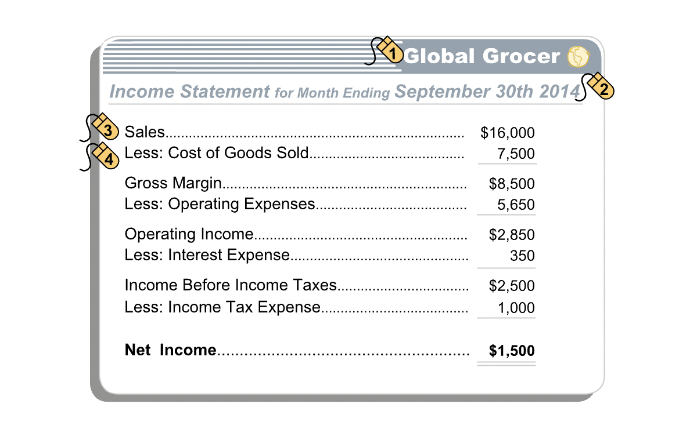
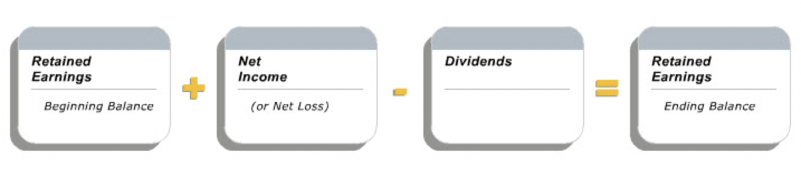
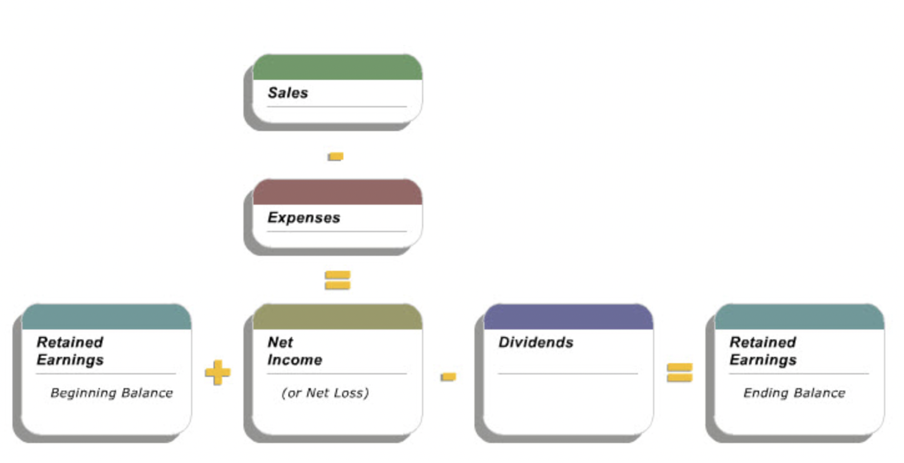

# The Income Statement

## Layout

- **"An income statement is a financial description of an entity's operating performance during an accounting period. It reports the entity's sales, expenses and net income or loss for the period. The income statement's basic equation is Sales minus Expenses equals Net Income."**

### Gross Margin

- **"The first segment of the income statement shows the company's sales, the cost of those sales and the difference, which is known as gross margin."**
- **"Subtract the entity's other expenses of running the business to determine net income."**

### Other Line Items

- Other expenses of running a business:
  1. Operating expenses
  2. Interest expense
  3. Income tax expense

## Link to Balance Sheet

- **"The balance sheets at the beginning and end of an accounting period are linked, by the income statement for the period, through the retained earnings account in the owners' equity section of the balance sheets."**

### Retained Earnings

- **"The retained earnings account is the sum of the company's net income to date, less dividends, if any, paid to the owners. The net income for the period is added to the retained earnings amount reported on the period's beginning balance sheet to determine the period's ending retained earnings, before any dividend payments."**

### Dividends

- **"Dividends are distributions of earnings to owners, usually in the form of cash. The payment of a dividend reduces the Retained Earnings account."**
- **"The payment of dividends is not an expense; it is a distribution of equity capital to investors. Hence, the payment of dividends is not recorded on the income statement; instead, it directly reduces the retained earnings account."**

### Summary

## Concepts

- **"The three concepts - realization, matching and conservatism - provide guidance as to the timing of the recognition and amounts of sales and expenses to be recorded by the entity. Like the other financial reporting concepts, when properly applied, they reflect a balance between relevance and reliability in the reported amounts."**

### Realization Concept

- **"Realization is the process of converting assets, such as merchandise for sale, into cash, cash equivalents, or good accounts receivable."**
- **"Realization plays an important role in determining when revenue is recognized. Two conditions must be satisfied. First, the revenue must be earned, which typically means that the customer has received the good or service. Second, the revenue must have been realized or realizable, implying that the customer has paid or is expected to pay for the merchandise."**

#### IFRS

- **"The IFRS and GAAP revenue recognition rules differ in their wording and underlying theory. IFRS recognizes revenue when the "risks and rewards of ownership are transferred." In contrast, GAAP, among other requirements, recognizes revenue when it is "earned." Despite these differences, in most cases the accounting for revenue transactions will be the same under either concept."**
- **"IFRS recognizes revenue when all the following conditions have been satisfied:"**
  - The seller has transferred to the buyer the significant risks and rewards of ownership of the goods;
  - The seller retains neither continuing managerial involvement to the degree usually associated with ownership nor effective control over the good sold;
  - The amount of revenue can be measured reliably;
  - It is probable that the economic benefits associated with the transaction will flow to the seller; and
  - The costs incurred or to be incurred in respect of the transaction can be measured reliably.

### Matching Concept

- **"The GAAP and IFRS revenue recognition criteria tells us when to recognize revenue. The Matching concept indicates what expenses should be recognized when revenue is recorded."**
- **"The timing of expense recognition is important since revenue less expenses equals net income. The Matching concept stipulates that expenses should be recognized in the same period as the relevant revenues are recognized. Costs related to this period's activities but which are not directly related to products and services sold, are expensed this period."**

|Type of Cost|How Recorded/Recognized as Expense|
|--|--|
|Associated directly with products or services offered for sale|Recognized as expense in the same period as revenue from these products and services is recognized.|
|Not associated directly with products or services or with future period revenues|Recognized as expense in the period in which they are incurred.|
|Associated with future period revenues|If meet asset definition, recorded as assets in the period in which they are incurred; recognized as expenses when the future revenue is recognized.|

### Conservatism Concept

- **"The Realization Concept and its associated "earned" requirements provide guidance as to when to recognize revenues and the Matching Concept provides guidance as to when to recognize expenses. The Conservatism Concept goes one step further by recommending that prudence be exercised in recording revenues and expenses. It says that revenues should be recognized only when reasonably certain, but expenses should be recognized as soon as reasonably possible."**
- **"Conservatism in financial accounting means that an entity should recognize only those revenues for which there is a high degree of confidence that they will be earned and realized."**
- **"Expenses, on the other hand, should be recorded as soon as they seem likely to be incurred. If the entity is uncertain whether to recognize an expense or about the amount of an expense, the conservatism concept encourages it to pro-actively estimate the cost and record the expense."**
- **"The conservatism concept also applies to the balance sheet. It suggests prudence in the recording of assets (record when reasonably certain) and in the recording of liabilities (record as soon as reasonably possible). Further, if two different estimates of a balance sheet amount were equally acceptable, the conservatism concept would guide accountant to record the smaller amount when measuring assets and the larger amount for liabilities."**
- **"Care must be taken when applying the conservatism concept. Otherwise, it can lead to bias in financial statements by understating profits in one period only to be followed by overstatement in a subsequent period."**

### Depreciation

- **"Depreciation of a tangible long-lived asset also reduces the balance sheet value of the asset. This is accomplished using an accumulated depreciation account, a counterpart to the asset account, but with the opposite sign. Its net effect is a reduction in the recorded value of an asset. An asset's historical cost (its depreciable purchase price) minus its accumulated depreciation yields its net book value. The net book value of each long-lived asset is used to compute total assets on the balance sheet."**
- Net book value = Historical Cost - Accumalated Depreciation

### Amortization

- **"For an intangible long-lived asset, we record a reduction in its remaining useful life by recording an amortization expense that directly reduces the value of the asset on the balance sheet. Note that amortization and depreciation expenses both reflect the diminishing useful lives of assets. However, the effect of each is recorded differently on the balance sheet. Depreciation expense is recorded for each depreciable tangible asset and it accumulates in a related contra-asset account on the balance sheet. Amortization expense is recorded for each amortizable intangible asset, and there is no associated contra-asset account: amortization expense directly reduces the related intangible asset account on the balance sheet."**

## Ratios

### Gross Margin Percentage

- **"Gross margin as a percentage of sales is dollar gross margin divided by sales, expressed as a percentage. Dollar gross margin is sales minus cost of goods sold. It represents the mark up on the cost of the products sold by a company."**
- **"By expressing dollar gross margin as a percentage of sales, we can compare the gross margin of a company at different points in time, or the gross margin percentages of different companies in similar businesses. This type of analysis provides financial statement users useful insights into a company's pricing strategy and practices."**

#### Comparison

- **"A company's gross margin percentage is influenced by its industry, its own pricing strategy, and the efficiency with which it produces its goods and services."**

### Return on Sales Percentage

- **"Return on sales percentage is calculated as net income per dollar of sales, or net income divided by sales, expressed as a percentage."**
- **"By expressing net income as a percentage of sales, i.e., by using return on sales, we can compare the performance of a company at different points in time, or the performances of different companies in similar businesses. This type of analysis provides financial statement users useful insights into a company's pricing strategy and its ability to control costs."**

#### Comparison

- **"A company's return on sales percentage depends on the nature of the industry the company is in, its own business strategy, and its efficiency in delivering its goods and services. Because net income is affected by interest and tax expense, unlike the gross margin percentage, return on sales is affected by the company's capital structure and its tax regime."**
