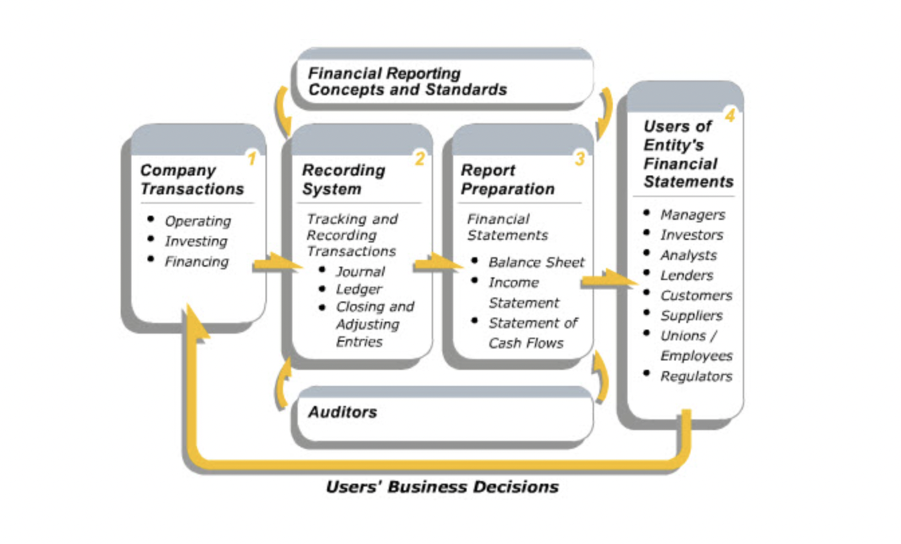

# Welcome to Financial Accounting

## The Accounting Process

- **"Financial accounting is a financial information system that tracks and records an organization's business transactions and aggregates them into reports for decision makers both inside and outside the business. A transaction is an event that has consequences for a business' financial condition. The event could be either external or internal to the business."**

- Business transactions are classified as operating, investing and financing.
- An auditor must make an independent judgment about the validity of a company's financial statements.