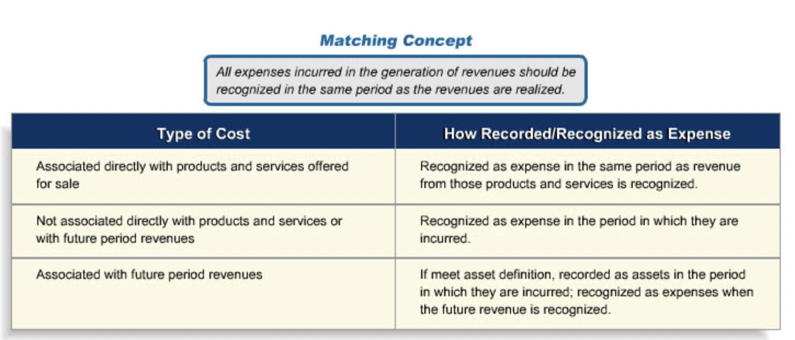
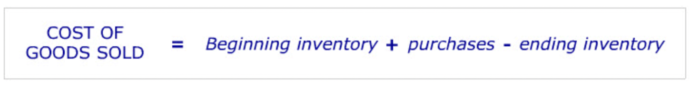
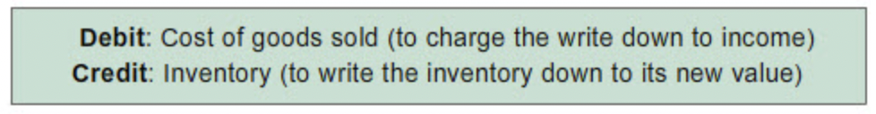
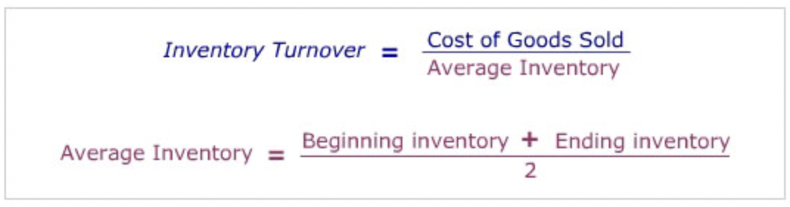
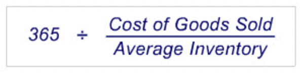

# Inventories and Cost of Sales

## Review of Matching

## Bought Merchandise Flow

- **"Here is the flow of inventory costs for a merchandise operation that buys its finished goods. Goods are purchased ready for sale from suppliers and held in inventory until they are sold. When they are sold their cost is moved to the cost of goods sold (COGS) account. As such, they move from the Balance Sheet to the Income Statement."**
- With one exception accounting records keep track of the flow of inventory costs not the flow of physical inventory items.

## Merchandise COGS

- **"The change in inventory during a period is simply the difference between purchases (which increase inventory) and transfers from inventory to cost of goods sold (which decrease inventory). Cost of goods sold can then be calculated using information on the beginning and ending inventory values and purchases as follows:"**

## New Challenges

### Price Change

- **"Manufacturing inventories are recorded at the cost of production. The costs included are those directly connected with purchasing and transporting materials to the production site and converting them to a finished product. These are termed product costs."**
- **"All product-related costs remain in inventory until the goods are sold. Then, costs for the goods sold are transferred to COGS at the end of the accounting period."**
- **"There are different kinds of product costs. The main ones are listed here:"**
  - Labor: The compensation of all manufacturing labor that can be traced to the production of the product.
  - Materials: Acquisition costs of all materials that eventually become part of the product.
  - Manufacturing Overhead: Manufacturing costs that are closely related to the making of the product, but that are not specifically production labor or materials. Depreciation on manufacturing equipment is an example.
- **"Selling expenses, and administrative expenses are not included in manufactured inventory costs and/or COGS. They are considered to be operating expenses, not product costs, and are expensed as incurred. Examples are: Advertising costs for the product, the cost of the running the purchasing department, office cleaning expenses."**
- **"Bought merchandise inventory is also not included in the manufactured inventory account. Their costs are assigned to a separate inventory account."**
- **"The process by which costs such as those listed here are allocated to products or to different activities within the company is known as cost accounting."**
- **"To calculate the amount of raw goods used in the production process, you use the following formula: Beginning raw materials inventory + raw materials purchases - ending raw materials inventory = raw materials transferred to work-in-process account."**
- **"There are two approaches to keeping track of inventories. They are the periodic and the perpetual methods. Under the perpetual method, the inventory account is adjusted as each addition and withdrawal is made. The periodic method, as its name indicates, adjusts the inventory account periodically based on actual inventory counts. For example, at the end of each accounting period, inventory on hand is counted and valued. This amount becomes the ending inventory."**
- **"One way to think about how to value inventory and COGS when there are cost changes is to imagine that inventory is stored in a large tub in successive layers. To get the inventory out, you can either empty it from the bottom of the tub, or from the top. Two of the most frequently used inventory costing approaches are "FIFO" and "LIFO." FIFO, which stands for First In First Out, assumes that you empty the tub from the bottom, so that the earliest layer of inventory costs would be the first removed and put into COGS. LIFO, or Last In First Out, assumes that you draw from the top of the tub, so that the most recently added layer of inventory costs would be the first taken out."**
- **"It is important to remember that different inventory accounting methods, such as FIFO and LIFO, reflect different assumptions about the flow of costs out of the inventory account. These cost assumptions do not necessarily reflect the actual physical flow out of its physical inventory, which may be very different altogether."**
- **"The FIFO or "First-In, First-Out" inventory valuation approach assumes that the cost of products coming into inventory first are also those costs that relate to the current sales. As a result, the costs of more recently purchased/produced goods are those costs remaining in the inventory account."**
- **"The LIFO (Last-In, First-Out) approach uses the opposite cost flow assumption to FIFO. Under LIFO cost of goods sold is calculated assuming that the cost of the most recently purchased/produced goods in inventory are the ones that are sold first."**
- LIFO is not permitted under IFRS
- **"Firms choose LIFO or FIFO for a variety of reasons. But one important consideration is taxes. Under the US tax code, if a company uses LIFO for tax return purposes, it must also use LIFO for financial reporting purposes. As a result, in the US, many companies whose merchandise or production costs are rising with inflation tend to use LIFO since it enables them to report lower taxable income and to pay lower taxes than under FIFO. In contrast, companies with falling per unit inventory costs, such as firms in the computer and electronics industries, tend to use FIFO because this method leads to lower taxable income for their firms."**
- **"US GAAP requires companies using LIFO to disclose in the notes accompanying their financial statements the FIFO cost equivalent of their LIFO inventories. The cost difference between FIFO and LIFO inventory is called the LIFO reserve."**
- **"The term LIFO "reserve" applies to the difference between the inventory cost under LIFO and FIFO. To arrive at the amount, you simply subtract the LIFO inventory cost from the FIFO inventory cost."**
- **"Inventory methods other than LIFO and FIFO that you should be aware include the specific identification and average cost methods."**
- **"While specific identification method resolves the question of where to assign the change in input costs, for companies with large inventories or undifferentiated products, it would be very time consuming and costly."**
- **"To determine the cost of inventory and COGS, the weighted average cost of the goods in the period's beginning inventory and all goods placed in inventory during the period is calculated. The new weighted cost per unit is used to cost COGS and ending inventory."**

### Inventory Write-down

#### Lower of Cost or Market

- **"Under normal circumstances, inventory is reported at its cost - the cost at which it was purchased or produced. If an event occurs, such as the rain storm, that reduces the value of the inventory below its original cost, the inventory must be written down to its new selling price less the cost of disposal. This requirement is referred to as the "lower of cost or market" rule."**
- **"The accounting entry to write the inventory down to its lower value is:"**

## Inventory Ratios

- **"Effective inventory management is an important determinant of how well a company manages its working capital (current assets - current liabilities). The shorter the time period an item is in inventory, the lower the average investment in inventory. Two ratios - inventory turnover and days inventory - are used to gauge the effectiveness of inventory investment management."**

### Turnover

- **"The "inventory turnover" ratio measures the average number of times inventory is sold during the year. Turnover is computed by dividing Cost of Goods Sold by the average inventory on hand during the year."**

### Days Inventory

- **"The "days inventory" calculation converts the turnover ratio to its days equivalent. The formula for computing days inventory is 365 divided by the turnover ratio:"**

### Interpretation

- **"Desirable inventory turnovers vary considerably from industry to industry and company to company. Managers keep a close eye on inventory turnovers for signs of inventory build-ups which could indicate obsolescence or anticipated sales growth in the next period."**
- **"Whether a company uses LIFO or FIFO has an impact on inventory ratios; if input costs are increasing, days inventory for a company under LIFO will be lower than under FIFO. This can make it difficult to compare the inventory ratios of companies when some use the LIFO method and others the FIFO method. One way to overcome this problem is to convert a LIFO inventory amount to its FIFO value equivalent by adding the LIFO reserve back to the LIFO inventory amount and then using the LIFO inventory's FIFO equivalent to compute inventory ratios."**
- Since funds are required to finance inventory, excess inventory is also associated with interest expenses or opportunity cost that reduce the company's earnings. 
- An increase in days inventory that a company is building is building stock for a product launch or that a company is finding it difficult to sell their products.
- The later would result in surplus of inventory and a  potential downward pressure on prices.
- Economic repressions or depressions are frequently foreshadowed by a build-up industrial inventory levels in the economy.
