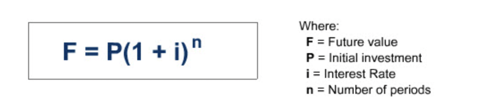
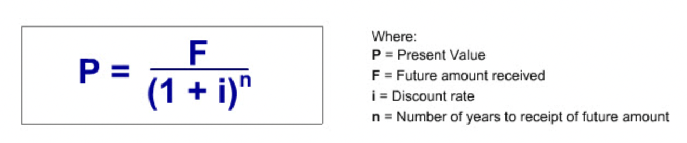
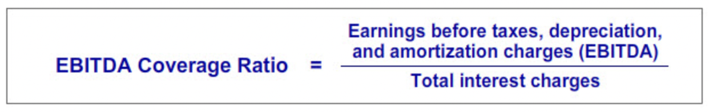

# Liabilities and Financing Costs

- **"To be recorded as a liability an obligation must meet three criteria:"**
  - It involves a probable future sacrifice of economic resources by the entity.
  - The transfer of economic resources is to another entity.
  - The future sacrifice arises from a past transaction or event.
-  **"Liabilities are organized into two categories: current and non-current. Current liabilities are obligations that are expected to become due within 12 months of the balance sheet date. Non-current liabilities are obligations that are expected to become due more than 12 months past the balance sheet date."**
- **"At the end of each reporting period, we record interest expense for the amount of interest earned by the lender during the period. This may have been paid in advance, paid at the end of the period or be as yet unpaid, requiring us to record a liability for the unpaid interest."**

## Executory Contracts

- **"Businesses frequently enter into contracts known in law as executory contracts. These are contracts where each party has yet to perform their part of the contract. These contracts often appear to obligate the parties. However, in general, accounting does not recognize obligations under an executory contract as liabilities."**

## Key Concepts

- **"Going Concern concept and the Conservatism concept, are particularly relevant for valuing liabilities."**
- **"Liabilities are recorded at the amount that would be required to settle them at the balance sheet date. In determining this amount, accounting assumes the liability will be settled in the normal course of business, that is, the business is considered to be a going concern."**
- **"The conservation concept suggests it is prudent to recognize liabilities as soon as reasonably possible and to avoid understating the amount of the obligation."**

## Zero Coupon Debt

- **"The typical zero coupon debt arrangement is as follows: The borrower agrees to pay the lender a fixed amount in the future in return for receiving an amount today that is less than the future payment. The borrower is also relieved from having to make periodic interest payments to the lender."**
- The name "coupon" is the name given to the required periodic interest payments by borrowers.
- If the lender does not require a periodic coupon payment, the value of the coupon is zero.

### Future Value

- **"Future Value Definition: The future value of any amount of money today is the amount that it would be worth if it were invested and grew at the specified compound interest rate over a given time period."**

### Present Value

- **"Present Value Definition: The present value of an amount to be received at a specified future date is the investment that we would need to make today that, with the benefit of compound interest, would grow to the same amount as the future amount to be received at the future date."**

### Present Value Tables

- **"Many accounting, finance and economics textbooks include tables that give the present value of a dollar received sometime in the future."**

### Accounting

- The received loan amount is added to the cash and the loan payable accounts.
- The interest that are supposed to be paid are recorded for each year and the loan payable along with the interest expense account is account is increased appropriately.
- Finally, when the amount is paid back to the lender, the cash account is decreased by the total amount paid and the loan payable account is closed.

## Leases

- **"A lease grants the lessee the use of property for a specified time in exchange for a series of periodic rental payments to the owner of the leased property. The owner of the leased property is called the lessor."**

### Introduction

- **"For legal purposes, leases are executory contracts. Normally, as noted earlier, accounting does not recognize executory contract obligations as liabilities. But some leases are an exception."**
- **"Even though the lessor is the legal owner of the leased asset, depending on the terms of the lease, the lease obligation may be recorded by the lessee as a liability and the leased asset as an asset. This lessee accounting treatment is required when the lease arrangement is in substance equivalent to an asset purchase. Accountants refer to these in substance purchase-type leases as capital leases. All other leases are called operating leases."**

### Capital Lease Accounting

- **"Because of the ownership-like nature of the lessee's rights to use the leased asset, capital lease accounting assumes the lessee has in substance financed the acquisition of the right to use the leased asset with an installment loan. Consequently, the lessee records initially the present value of the lease payments as a liability along with an asset in the same amount. Subsequently, the leased asset is depreciated like any similar owned asset and the liability is accounted for as an installment loan."**
- In the case of capital leases, the lessor accounts for the lease arrangement as if it was an installment loan to the lesse. Lessors call these leases financing leases. 

#### GAAP Capital Lease Criteria

- **"Under GAAP, a lease arrangement is classified as a capital lease if one of the following criteria are met:"**
  - Ownership of the leased asset is transferred to the lessee at the end of the lease term.
  - The lessee has an option to purchase the leased asset at a bargain purchase price.
  - The term of the lease is 75 percent or more of the leased asset's economic life (i.e., its productive life).
  - The present value of the lease payments discounted by the lessee's borrowing cost is 90 percent or more of the fair value of the property.
- **"For the purpose of applying these tests, the lease term includes renewal options."**
- **"The particular depreciation method applied to the leased asset depends on the basis for classifying the lease as a capital lease. If the capital lease classification is based on the lease meeting either the 75 percent or 90 percent test, the asset is depreciated over the lease term and salvage value is not considered. In contrast, if the capital lease classification is based on the lease meeting either the bargain purchase or ownership transfer test, the asset is depreciated over its useful life to the lessee and salvage value is considered. The useful life may be longer than the lease term. If a capital lease classification could be based on either the bargain purchase of ownership transfer test and one or both of the other two tests, the bargain purchase and transfer ownership test depreciation method is applied."**

#### IFRS Capital Lease Criteria

- **"Under GAAP and IFRS, the accounting entries for a lease classified as a capital lease are the same. The difference between the two standards lies in the tests used to identify capital leases."**
- **"IFRS's capital lease accounting standard is "principle-based" accounting standard. IFRS stipulates that if substantially all the "risks and rewards incident to ownership" lie with the lessee, the lease is a capital lease. Otherwise, it is an "operating lease.""**

#### Present Value

- **"The lease payments that the lessee promises in the future can be valued today by taking their present values and summing them up."**
- **"A lease agreement typically involves making identical payments each year for a specified period. This is called an annuity. Many textbooks include an annuity table that shows the present value of an annuity of one dollar payments for different periods and interest rates. This table is helpful for calculating good approximations of the present value of a stream of constant annual payments, such as lease rentals."**

#### Illustration

- **"The first step in accounting for this capital lease is to calculate the present value of the lease payments. This amount will be the initial amount recorded for the capital lease related liability and asset."**
- **"Once we know the present value of the lease payments, we can record the value of the leased asset and liability."**
- **"The second step in accounting for the illustration capital lease is to generate the capital lease obligation amortization schedule and related journal entries. Remember accounting views this obligation as being similar to an installment loan. Therefore, each rental payment will consist of two components. Namely, an interest payment on the outstanding balance of the loan and a repayment of part of the loan's outstanding balance."**
- **"The last step in accounting for the illustration capital lease is to generate the depreciation schedule and related journal entries for the leased asset."**

### Operating Lease Accounting

- **"If a lease is not a capital lease, it is classified as an operating lease. The accounting for an operating lease is straightforward. The periodic lease payments are simply recorded as a lease expense each year. Neither a liability nor an asset is recognized."**
- The full amount of an operating lease is classified as operating cash flow. While in capital lease rental payment, only the interest amount is classified as operating cash flow and the remaining portion is classified as financial cash flow.

## Contingent Liabilities

- **"Loss contingency: The obligation involves uncertainty as to the possible cost which will only be resolved by some future event that may or may not happen."**
- Examples of loss contingencies: environmental clean-up cost, possibility of some account receivable not being collected, future warranty costs, and the cost of unresolved litigation.
- Gain contingencies are opposite of loss contingencies. Example: A potential litigation award.
- Gain contingencies are not recognized until they are realized.

### Required Conditions

- **"The determination of whether or not a loss contingency should be recorded as a liability requires judgment."**
- **"A loss contingency is recognized as a liability when both of the following conditions are met."**
  - Information available prior to the issuance of the financial statements indicates that it is probable that an asset has been impaired or a liability has been incurred (That is, the three liability criteria have been met).
  - The amount of the loss can be reasonably estimated.

### Future Events

- **"Implicit in the first required condition for recognition is that it must be probable that a future event will occur confirming the fact of the loss. In making this judgment, accountants recognize the likelihood of the future event that will confirm the loss has occurred can range from probable to remote."**
- If the probability of the future event is less than likely to occur, accounting may still require disclosure of the loss contingency in the notes accompanying the financial statements.

### Note Disclosure

- The notes accompanying financial statements are an integral part of the financial statements. They explain the company's accoiunting policies and provides contingencies disclosure, information that financial report readers need to know so that the financial statements themselves are not misleading and are transparent.
- Read financial notes before reading financial statements.

### IFRS

- **"IFRS refers to those contingent liabilities that GAAP recognizes on the balance sheet as "provisions," not "contingent liabilities." The term "contingent liability" is reserved to describe those unrecognized contingent liabilities that under GAAP and IFRS may or may not have to be disclosed."**

## Debt Ratings

- **"The investment quality of the debt of companies may be rated by debt-rating services. For example, Moody's, a leading debt rating service, issues ratings that are expressed in terms such as AAA (the highest rating) all the way down to C (the lowest rating). The rating represents the likelihood the debtor will pay the debt's principal and interest on time. For the most part, the higher the debt rating, the lower is the required rate of return of investors. Debt rated triple B or better is considered to be of "investment grade." It is considered to be a relatively safe investment. An investment grade rating is considered desirable since many financial institutions by regulation or policy cannot hold debt rated less than investment grade. Many unrated and less than investment grade debt are referred to as "junk bonds.""**

### Interest Coverage Ratio

- One of the most popular interest coverage ratios is EBITDA coverage ratio.
- **"Generally, the higher the EBITDA coverage ratio, the higher is a company's debt rating."**

