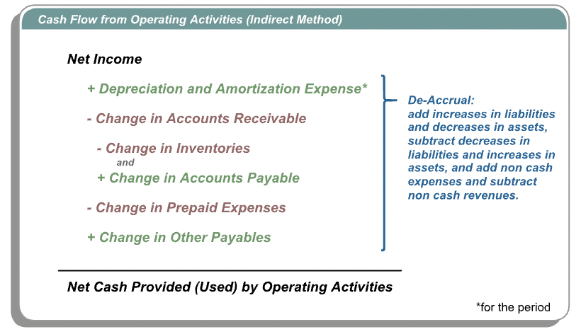
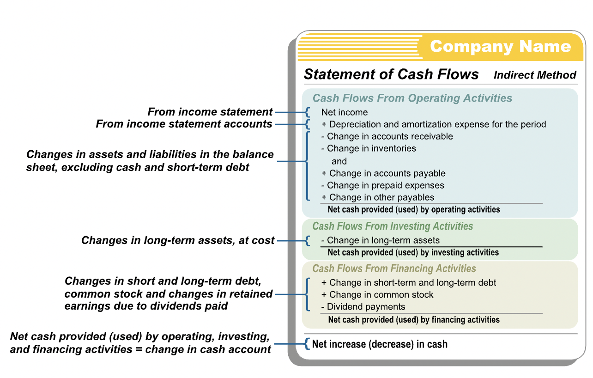

# The Statement of Cash Flows

## Direct Method

- **"The direct method statement of cash flows for an accounting period summarizes the transactions that have been posted to the cash ledger account during the period. This information is presented in three categories: operating, investing and financing activities."**
- **"The GAAP and IFRS rules for classifying cash flows as either operating, investing and financing differ in several respects."**

### Preparation

- **"The direct method statement of cash flows is constructed at the end of an accounting period using the cash account in the ledger. Cash is an asset account. Each debit to cash during the period is an increase in the entity's cash balance (a source of cash) and each credit is a decrease (a use of cash). We simply classify each debit and credit in the cash account as either an operating, investing, or financing item and re-arrange them into these three categories to obtain the direct method statement of cash flows."**

## Indirect Method

### Differences

- The cash flow statement made using direct and indirect method differ in the format and information included in the cash flows from operating activities section.
- In direct method, every line the operating activity section represents an actual cash flow.
- In indirect method, we start with net income and make some adjustments in the operating section to arrive at the cash flows from operations. These adjustments are needed because the net income amount is the result of accrual accounting to record the financial activities of the period and we wish to use it to arrive at the cash effect of operations during the period. 
- Apart from net cash provided, none of the activities in the indirect method represent actual cash flows.

### Accruals and De-Accruals

- **"Recall that accrual accounting records the economic effects of transactions in the period in which those transactions occur, rather than in the periods in which cash is received or paid by the entity. Under accrual accounting, we record some accruals that have related cash flows in the future, and the resultant balance sheets and income statements reflect the effects of those accruals rather than use future cash flows."**
- In the indirect method of cash flows, we begin with the accrual accounting net income amount - the economic result of operations during the period. Then we apply a number of de-accruals or reversals or accruals - amounts that explain the difference between the economic and cash impact of various operating transactions during the period - to arrive at the cash impact of operations during the period.

### Why the indirect method?

- **"Given the relative complexity of the operating section of an indirect method statement of cash flows, you might wonder why do accountants use them at all? Answer: Because the operating section of the indirect method statement explains the difference between the net income and the operating cash flows of the period, it provides readers with information about the extent to which and the means by which the entity's net income of the period has resulted in operating cash flows."**
- **"The Financial Accounting Standards Board requires entities that use the direct method in their statement of cash flows to present a separate reconciliation of net income to operating cash flows using the indirect method. As a result, most companies choose to present only the indirect method statement of cash flows."**

## Net Income & Op. Cash Flows

- **Accrual accounting focuses on capturing the economic meaning of a transaction, rather than its cash effects. This usually results in a difference between a period's net income and the operating cash flow to the entity, although both are the result of operations during the period."**
- **"We start with net income of the period, add depreciation and amortization expense, add decreases (or subtract increases) in accounts receivable, add decreases (or subtract increases) in inventory, add increases (or subtract decreases) in accounts payable, add decreases (or subtract increases) in pre-paid expenses, and add increases (or subtract decreases) in other payables. This will give us net cash provided or used by operating activities during the period."**

- **"The adjustments to net income are themselves not cash flows. These are the sales and expense-related de-accruals made to reconcile the difference between net income and cash flow from operations. These amounts are calculated from the change between the beginning and ending balances of particular current asset and current liability accounts during the accounting period, excluding changes in the cash account and short-term debt (a financing item)."**

## Relation to Balance Sheet

- **"The indirect method statement of cash flows does not require any new accounts. In practice, the indirect method statement of cash flows for an accounting period is constructed using the period's net income, the period's depreciation and amortization expenses, differences between the period's beginning and ending current asset and liabilities accounts, excluding cash and short-term debt. Here is a schematic of the entire indirect method statement, indicating the sources of the various line item amounts."**

## Interpretation

- **"Net cash flow is a very important financial metric in any business. Users of financial statements want to know how much cash was generated or used by a business during an accounting period and how it was generated or used. The inferences made by a reader from a statement of cash flows depend on the type of company the statement represents - what industry it is in and the life-stage it is in. A start-up software company is expected to have a significantly different pattern of cash flows from those of a mature chemicals manufacturer."**
- **"For a new business, users of the entity's financial statements look for evidence that the business is raising sufficient cash to support the necessary investments and ramp up of operations through the early periods of slow sales and collections from customers. The statement of cash flows can aid in this type of analysis."**
- **"In the case of a more mature business, users of an entity's financial statements look for evidence that its operations are generating enough cash, and that it is using financing prudently enough to support its growth, pay dividends, and invest in long-term, productive assets. The statement of cash flows can also aid in this type of analysis."**

## Analysis of Indirect Statement

- **"By organizing the information in a particular way, the indirect method statement of cash flows provides important information to users of an entity's financial statements that is not available from a direct method statement of cash flows."**
- **"The operating section of the indirect method statement of cash flows explicitly provides the depreciation and amortization expenses for the period, information that would otherwise be scattered in the balance sheet and embedded in various expense accounts on the income statement. It is expected that a mature company's capital expenditures - its cash payments for non-current assets -- meet or exceed the depreciation expense of the period. This would indicate that the company is replacing long-lived assets at about the same or greater rate than their economic benefits are being consumed."**
- **"Suppose a company has a significantly higher net income than net cash flow from operations in successive periods. This may be explained by the fact that the company is growing rapidly, making sales on credit, and raising the necessary cash from financing activities. But, it could also indicate that the company, despite a healthy net income, is failing to collect cash from its customers in a timely manner. These sorts of effects would be easily seen from the change in receivables in the operating section of the indirect method statement of cash flow."**
- **"There are many different types of analyses that may be conducted with the information available in an indirect method statement of cash flow to assess the health of - or trends in the health of - an entity."**

