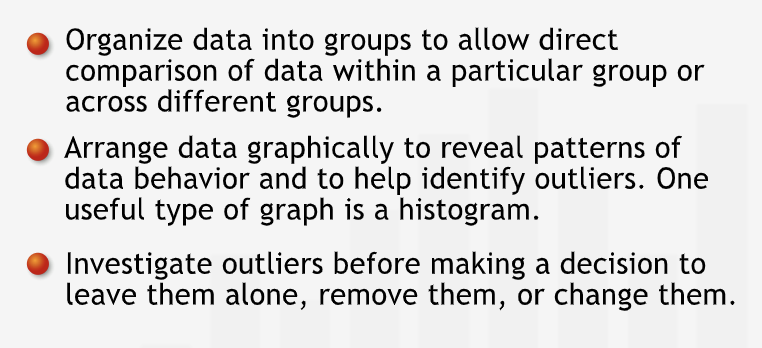
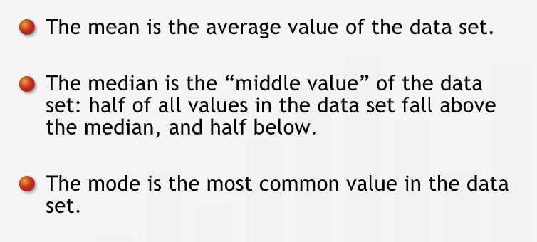
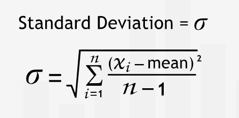
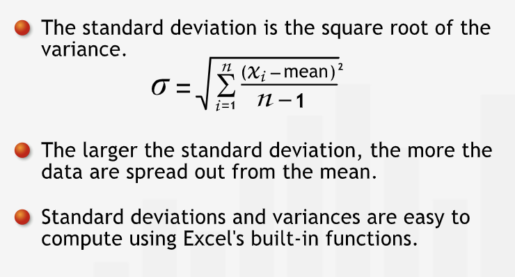
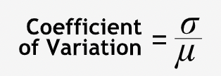

# Basics: Data Description

## Describing and Summarizing the Data

- **"Data can be represented by graphs like histograms. These visual displays allow you to quickly recognize patterns in the distribution of data."**

### Working with Data
- Every data that we encounter has a story to tell. Every data has some valuable information that is required for better decision making.
- It is necessary to extract as much information as possible from the available data. This exercise can be challenging but it reveals certain subtle details which are absolutely required for monagaers.
- Some important questions to consider after acquiring the data:
  1. Where do the data come from?
  2. How were they collected?
  3. How can we help the data tell their story?
- Get a preliminary sense of data before starting with any analysis. This includes, patterns, trends, relationships, grouping etc. that exist in the data.
- **"Grouping data can help us identify patterns within a single category or across different categories."**

#### Histograms

- The grouped data can be graphed in order to see the pattern visually.
- Graphed data can helps us deepen our understanding of the data set and the situation it describes.
- The plot of a number of values in each group is called a histogram.
- **"A histogram shows us where the data tend to cluster."**

#### Outliers

- **"Data points like this one that fall far from the rest of the data are known as outliers."**
- Before acting on outliers, identify the source of the outliers. Examine the underlying situation in great detail.
- Outlier can be dealt by: leave the outlier alone, or — very rarely — remove it or change it to a corrected value.
- **"Excluding or changing data is not something we do often. We should never do it to help the data 'fit' a conclusion we want to draw. Such changes to a data set should be made on a case-by-case basis only after careful investigation of the situation."**

#### Summary

- **"With any data set we encounter, we must find ways to allow the data to tell their story. Ordering and graphing data sets often expose patterns and trends, thus helping us to learn more about the data and the underlying situation. If data can provide insight into a situation, they can help us to make the right decisions."**

### Central Values for Data

- Eventhough graphs are quite useful, sometimes it is necessary to represent data using single numbers.

#### The Mean

- Average or mean is the summ of all the values divided by the number of elements in the data set. It is represented by $\mu$.
- **"The mean is by far the most common measure used to describe the "center" or "central tendency" of a data set. However, it isn't always the best value to represent data. Outliers can exercise undue influence and pull the mean value towards one extreme."**
- **"In addition, if the distribution has a tail that extends out to one side — a skewed distribution — the values on that side will pull the mean towards them."**

#### The Median

- Mean is often not the best value to represent the data when the data is skewed. In these cases, median isused to represent the data.
- **"The median is the middle value of a data set whose values are arranged in numerical order. Half the values are higher than the median, and half are lower."**
- **"With an odd number of data points, listed in order, the median is simply the middle value. In a data set with an even number of points, we average the two middle values."**
- To decide between mean and median for representation, weight the pros and cons for each as per the situation.

#### The Mode

- **"Mode - the data set's most frequently occurring value."**
- A distribution with two peaks is called a bimodal distribution.

#### Summary

- **"To summarize a data set using a single value, we can choose one of three values: the mean, the median, or the mode. They are often called summary statistics or descriptive statistics. All three give a sense of the "center" or "central tendency" of the data set, but we need to understand how they differ before using them:"**

----

## Variability

- The central values does not give any information about the spread of the data.
- **"Two sets of data could have the same mean and median, and yet be distributed completely differently around the center value."**

### The Standard Deviation

- Sense of the spread of the data is critical.
- The summary statistic that captures the level of dispersion in a set of data around the mean is standard deviation. It is represented by $\sigma$.

- A large standard deviation signifies and the data is scattered and that there is greater variability in the data, while a small standard deviation signifies that the data is tightly clustered around the mean.

#### Calculating

- Calculating the standard deviation is a two step process
  1. Calculate the variance - The square of the differences between mean and the actual values. The differences are square to avoid negative values cancelling out positive values. Squaring in the variance removes the sense of unit of the quantity under measurement. 
  2. To express the variability in the same unit as the data, we take the sqaure root of the variance.

#### Interpreting

- **"For a data set, a smaller standard deviation indicates that more data points are near the mean, and that the mean is more representative of the data."**
- **"With a larger standard deviation, the data would be spread farther from the mean."**

### Summary

- **"The standard deviation measures how much data vary about their mean value."**

### The Coefficient of Variation

- **"Standard deviations must be considered within the data's context."** It is necessary to compare the magnitude the standard deviation as compare to the mean around which it is varying.
- **"The coefficient of variation is simply the ratio of the standard deviation to the mean. It can be interpreted as the standard deviation expressed as a percent of the mean."** This tells us about the relative volatility as a standardized measure. 
- The larger the coeeficient, the larger the variability.
- **"The coefficient of variation describes the standard deviation as a fraction of the mean, giving you a standard measure of variability."**

#### Summary

- **"The coefficient of variation expresses the standard deviation as a fraction of the mean. We can use it to compare variation in different data sets of different scales or units."**

----

## Relationship Between Variables

### Two Variables

- Histograms can only be used for one variable.
- For two variables, scatter plot can be used.
- Do not draw conclusions about causality from the scatter plot.
- **"Managers who use data to make decisions without firm understanding of the underlying situation often make blunders that in hindsight can appear as ludicrous."**

#### Variable and Time

- **"Sometimes, we are not as interested in the relationship between two variables as we are in the behavior of a single variable over time. In such cases, we can consider time as our second variable."**
- If the other variable is time, the graph is called as time series.
- **"Time series are extremely useful because they put data points in temporal order and show how data change over time."**
- **"Time series will help us recognize seasonal patterns and yearly trends. But we must be careful: we shouldn't rely only on visual analysis when looking for relationships and patterns."**

#### False Relationships

- **"Our intuition tells us that pairs of variables with a strong relationship on a scatter plot must be related to each other. But we must be careful: human intuition isn't foolproof and often we infer relationships where there are none. We must be careful to avoid some of these common pitfalls."**

#### Hidden Variables

- **"Even when two data sets seem to be directly related, we may need to investigate further to understand the reason for the relationship."**
- **"We may find that the reason is not due to any fundamental connection between the two variables themselves, but that they are instead mutually related to another underlying factor."**
- **"In many business contexts, hidden variables can complicate the investigation of a relationship between almost any two variables."**
- **"Keep in mind that scatter plots don't prove anything about causality. They never prove that one variable causes the other, but simply illustrate how the data behave."**

