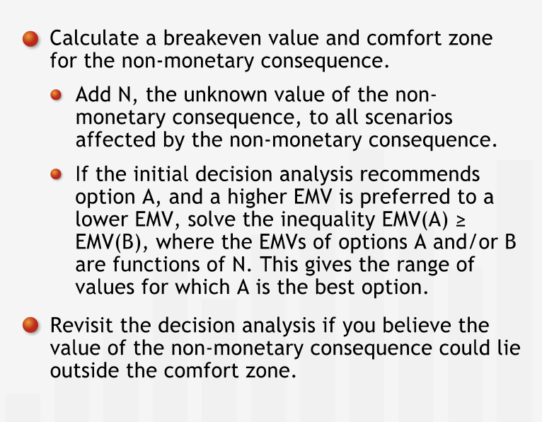

# Decision Analysis

## Introduction

### Introducing Decision Analysis

- **"Decision-making is an essential management responsibility. Managers are charged with choosing from multiple courses of action that can each lead to radically different consequences."**
- **"When faced with a choice of actions and a range of possible outcomes, decision making can be difficult, in large part due to uncertainty. Although the course of action we choose influences the outcome, much of what happens is not only beyond our control, but beyond our powers to predict with certainty."**
- **"Decision analysis tools can help managers weigh alternative options and make informed and rational choices."**
- **"In a world of uncertainty, applying decision analysis will not guarantee that each decision you make will lead to the best result, or even to a good result. But if you apply effective decision analysis consistently over the course of a managerial career, you are almost certain to gain a reputation for sound judgment."**

#### Summary

- **"Decision analysis is a set of formal tools that can help managers make more informed decisions in the face of uncertainty. Although applying even the most rigorous decision analysis does not guarantee infallibility, it can help you make sound judgments over the course of your career."**

---

## Decision Trees

### Uncertainty and Probability

- **"Uncertainty clearly has a quantitative dimension: we can distinguish between degrees of uncertainty."**
- **"Probability is a measure of uncertainty."**
- **"Events that are impossible are said to have zero (or zero percent) probability, and events that are absolutely certain are said to have a probability of one (or 100%)."**
- We have a set of events and a set of outcomes. We form the ratio of the number of times a particular event occurs to the total number of experiments. The probability of that particular event is the value that ratio approaches as the total number of experiments approaches infinity.
- **"Your subjective estimate may be based on an informal assessment of relative frequency."**
- **"It makes sense to measure the uncertainty due to a lack of information the same way we measure the uncertainty due to our inability to predict the outcomes of future events."**

#### Summary

- **"Uncertainty makes decision-making challenging. We can be uncertain about outcomes that have or have not occurred. To make the most informed decisions, we quantify our uncertainty using probability measures. Probability is measured on a scale from 0% to 100%: events with 0% probability are impossible; events with 100% probability are certain. An event's probability can often be determined by observing the relative frequency of its occurrence within a set of opportunities for the event to occur. For events for which relative frequencies are difficult to assess, we often make subjective estimates of the probabilities. Though not based on "hard" data, these estimates are often a sufficient basis for sound decision making."**

### Structuring Decision Trees

- **"Graphical representations are often a highly efficient way to organize and convey information. Scatter plots and histograms efficiently communicate distributions of data, an organizational chart can quickly outline the structure of a company; and pie charts effectively express information about proportions and probabilities."**
- Decision tree: a graphical tool that helps inform and organize the decision-making process.
- **"Decisions aren't the only points at which alternatives can branch off. Events with uncertain outcomes also lead to branching alternatives. Each of the uncertain outcomes corresponds to a separate branch on the decision tree."**
- **"Decision trees have two types of branching points, or nodes. At decision nodes, the tree branches into the alternatives the decision-maker can choose. We use square boxes to represent decision nodes."**
- **"At chance nodes, the tree branches because the uncertainty of the business world permits multiple possible outcomes. We represent chance nodes by circles."**
- **"We arrange the nodes from left to right in the order in which we will eventually determine their results."**
- **"One of the challenges of creating a decision tree is determining the correct sequence of nodes: in what order will the relevant outcomes be determined? Which events "depend" on the occurrence of other events? What alternatives are created or foreclosed by prior decisions or by the outcomes of uncertain events?"**
- **"Drawing a decision tree forces us to delineate each alternative and clarify our assumptions about those alternatives. Thus, even before we use a tree to make a decision, simply structuring the tree helps us clarify and organize our thoughts about a problem. A decision tree is also useful in its own right as a tool for communicating our understanding of a complex situation to others."**
- **"Categorizing branching points as decision or chance nodes makes clear which events and outcomes are under our power and which are beyond our control."**
- **"Writing down alternatives in a systematic fashion often allows us to think of ideas for new alternatives."**

#### Summary

- **"Decision trees are a graphical tool managers use to organize, structure, and inform their decision-making. Decision trees branch at two types of nodes: at decision nodes, the branches represent different courses of action the decision-maker can choose. At chance nodes, the branches represent different possible outcomes of an uncertain event - at the time of the initial decision, the decision maker does not know which of these outcomes will occur (or has occurred). The nodes are arranged from left to right, in the order in which the decision-maker will determine which of the possible branches actually occurs."**

### Incorporating Data into Decision Trees

- **"Laying out a decision tree — mapping a logical structure and identifying the alternative scenarios — is an essential first step in the decision-making process."**
- **"In the business world, success is often measured in profits."**
- Sometimes, the outcomes might not be a single value but a range of values.
- **"Although it is mathematically possible to analyze the full range of possible outcomes, the procedure for doing so is usually more complicated and time consuming than is warranted for many decision problems. In practice, considering only a few representative scenarios will typically lead to good decisions."**
- **"When we use a scenario to represent a range of possible outcomes, the outcome figure we assign to that scenario should represent the weighted average of all outcomes in the range that scenario represents."**

### Decision Trees and Probabilities

- **"To each branch emanating from a chance node we must associate a probability: the probability of that outcome occurring. These probabilities may be based on historical data or on our best judgment of the likelihood of each outcome."**
- **"When assigning outcomes and probabilities to chance nodes, we must meet two requirements."**:
  1. Outcomes that branch off from the same chance node must be "mutually exclusive." Thus, for example, two outcomes emanating from the same node cannot both occur at the same time: the occurrence of one outcomes excludes the occurrence of any other.
  2. The set of outcomes that branch off from the same chance node must be "collectively exhaustive": the branches must represent all possible outcomes."**
- **"In practice, we typically don't depict every possible outcome separately."** This is particularly in the case when there exist range of outcomes instead of fix specidic outcomes. The complete range of coutcomes must be categorized in such a way that they are collectively exhaustive.
- **"Also, we usually consider extremely unlikely but not impossible events to be included in one of the existing branches, or if sufficiently unlikely, to be irrelevant to decision-making."**
- **"When we construct a chance node, we must make sure that the outcomes emanating from that node are mutually exclusive and collectively exhaustive. Since it is certain that one and only one of the possible scenarios will occur, the individual probabilities must add up to 100%."**

#### Summary

- **"For a decision tree to effectively inform a decision, it must incorporate two types of relevant data: endpoint values corresponding to each scenario and the probabilities of the possible outcomes of each uncertain event. An outcome value is associated with a scenario - a unique path from the first node on the left of the tree to an endpoint on the right. We place the appropriate probability on each branch emanating from a chance node. Outcomes represented by branches emanating from the same chance node must be mutually exclusive and collectively exhaustive."**

---

## Comparing the Outcomes

### Introducing the Expected Monetary Value

- **"The EMV is a weighted average of the expected outcomes of the scenarios due to a decision"**
- **"We can use the EMV as a measure with which to compare alternative options. First, we calculate the EMV for each chance node, beginning at the right of the tree."**
- **"At a decision node, we choose the best EMV of all the branches emanating from that decision node. Selecting the option with the best EMV and removing all other options from consideration is known as "pruning" the tree."**
- **"Any decision tree — no matter how large or complex — can be analyzed using two simple procedures. At each chance node, calculate the EMV, collapse the branches to a point, and replace the chance node with its EMV. At each decision node, compare the EMVs and prune the branches with less favorable EMVs. This entire process is known as folding back the decision tree."**

#### Summary

- **"We often use expected monetary value (EMV) to quantify the value of uncertain outcomes. The EMV is the sum of the values of the possible outcomes of an uncertain event after each has been weighted by its probability of occurring. The EMV can be interpreted as the expected average outcome value of the uncertain event, if that uncertain event were repeated a large number of times. To analyze a tree, we "fold it back": we move from right (the future) to left, finding the EMV for each node. For chance nodes we calculate the EMV as described below. For decision nodes we simply choose the option with the best EMV — lower costs or higher profits — among the choices represented by a decision node's branches and prune the others."**

### Relevant Costs

- **"Costs that were incurred or committed to in the past, before a decision is made, contribute to the total costs of all scenarios that could possibly unfold after the decision is made. As such these costs — called sunk costs — should not have any bearing on the decision, because we cannot devise a scenario in which they are avoided. It isn't wrong to include a sunk cost in the analysis as long as it is included in the value of every outcome. However, including sunk costs distracts from the differences between scenarios — the relevant costs."**
- **"Misinterpreting a sunk cost as a cost that weighs on only some of the scenarios is a common error."**
- **"Good decisions are made based on possible future outcomes, not on the desire to correct or justify past decisions or mistakes."**
- **"Another common decision-making error is to omit from the analysis relevant costs that should have a bearing on the decision."**
- **"Opportunity costs are an important cost category that decision makers often neglect to include in their analyses."**
- **"We should also take non-monetary costs into account. Jen will feel sad at leaving her trusted vehicle and companion on many a road trip behind. Although such costs can be difficult to quantify, they should not be neglected."**
- Sentivity Anlysis is used to take into account non-monetary costs.

#### Summary

- **"Among the most common errors in decision analysis is the failure to properly account for the costs involved in different possible scenarios. On the one hand, relevant costs such as opportunity costs or non-monetary consequences are often omitted. On the other hand, irrelevant costs such as sunk costs are incorrectly included in the analysis. Sunk costs are costs that were incurred or committed to prior to making the decision and cannot be recovered at the time the decision is being made. Since these costs factor into any possible future outcome, they can be safely omitted from the analysis; sunk costs must never be included in only selected branches of a decision tree."**

### Time Horizons

- Costs can only be compared when values at same point of time. Compare the present value of costs associated with each option.
- **"The value of an asset at the end of the time horizon is typically called its terminal value."**

#### Summary

- **"When we make a decision, we need to choose a time horizon over which we quantify the outcomes of our decision. To compare monetary values that take place at different times, we must account for the time value of money by comparing cash flows at their values at a common point in time. Generally, we compare the present values — or net present values — of different outcomes by discounting future cash flows at the appropriate discount rate. Terminal values of assets held at the end of the time horizon must be determined and discounted to their present value."**

---

## Sensitivity Analysis

### A Decision's Sensitivity to Outcome Estimates

- Decision may be sensitive to the profit or loss in each decision.
- Breakeven value is the value of EMV at which the decision changes.
- **"Once we calculate a breakeven value, we know whether or not expending additional time and other resources to find a more accurate estimate is worthwhile. The breakeven value establishes a comfort zone: as long as we are confident that the value we are estimating is within the zone, we can feel comfortable choosing the option recommended by our initial analysis, based on our original estimate."**
- **"If we think the value we are estimating could be close to the breakeven value, we need to be more cautious. If the true value we are trying to estimate could lie outside of the comfort zone, we might want to try to make our estimate of that value more accurate before we reach a final decision."**
- **"How confident we are that the true value we are estimating lies inside the comfort zone given by the breakeven analysis is a matter of judgment and experience. Sometimes, we might collect sample data to estimate an outcome value. In this case, we should look closely at the variation in the data to see how widely and in what way the data can vary."**
- **"Calculating a breakeven value for data used in a decision analysis is called sensitivity analysis: for each estimated value in the analysis, we check to see by how much it would have to change to affect our decision, assuming our estimates for all the other data are correct."**
- **"Sensitivity analysis is an important and powerful tool for management decision-making. Managers who base decisions on an initial analysis without performing sensitivity analysis on critical data risk lulling themselves into a false sense of security in their decisions."**

#### Summary

- **"After completing an initial decision analysis, always conduct a sensitivity analysis for each outcome value estimate you are uncomfortable with. First, calculate the outcome value's breakeven value: the value for which the EMV of the option initially recommended by the decision analysis ceases to be the best EMV. The breakeven value defines a comfort zone: If we believe that the actual outcome value might be outside that zone — thereby changing the optimal decision — we should reconsider our analysis and refine our estimate of the outcome value in question."**

#### Evaluating non-monetary consequences

- **"Sensitivity analysis can give us a "reality check" on how highly we value non-monetary consequences such as frustration, reputation costs and benefits, and sentimental values. Although it may be difficult to assign a value to such consequences, we can often answer questions about the most we'd be willing to pay to avoid (or to obtain) them by calculating a threshold value."**

##### Summary

- **"To incorporate non-monetary consequences into a decision, first find the option with the best EMV. Then, add the non-monetary consequence to the outcome values of all scenarios affected by that non-monetary consequence, and calculate the breakeven value for which the option recommended by the initial decision analysis ceases to have the best EMV. The breakeven value defines a comfort zone: If we believe that the actual value of the non-monetary consequences might be outside that zone — thereby changing the optimal decision — we should try to gain a firm estimate of the non-monetary consequence's value."**

#### A Decision's Sensitivity to Probability Estimates

- **"Decision-making is an iterative, multi-step process. When analyzing a decision, we should first construct and analyze a decision tree based on our best estimates of the outcomes and probabilities involved. After reaching a tentative decision, it is critical to scrutinize the data used in a decision analysis and conduct sensitivity analyses for each estimate that we feel unsure about."**
- **"As long as we are comfortable that the true value we are estimating is within the range specified by the breakeven calculation, we can confidently proceed with our decision. If not, we should focus our efforts on refining our estimates for those values to which our decisions are most sensitive."**

- **"Finally, we should note that managers sometimes need to test the sensitivity of their decisions to two or more estimates simultaneously. Sensitivity analysis techniques can be extended to address these situations; these techniques are beyond the scope of this course."**

##### Summary

- **"After completing an initial decision analysis, always conduct a sensitivity analysis for each probability value you are uncomfortable with. First calculate the probability's breakeven value: the probability for which the EMV of the option initially recommended by the decision analysis ceases to be the best EMV. The breakeven value defines a comfort zone: If we believe that the actual probability might be outside that zone — thereby changing the optimal decision — we should reconsider our analysis and refine our estimate of the probability in question."**

