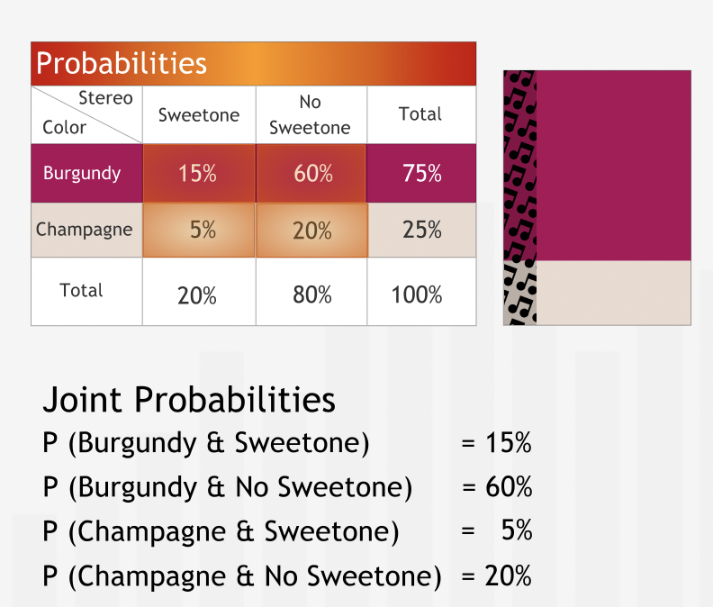
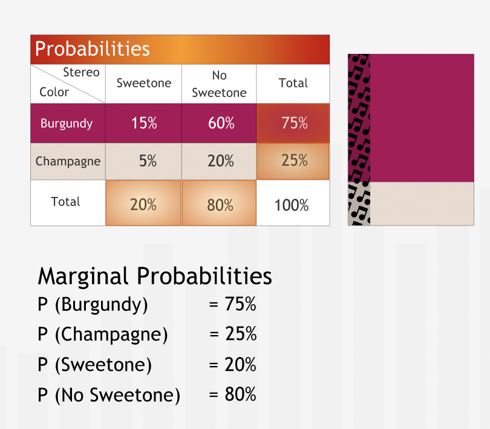
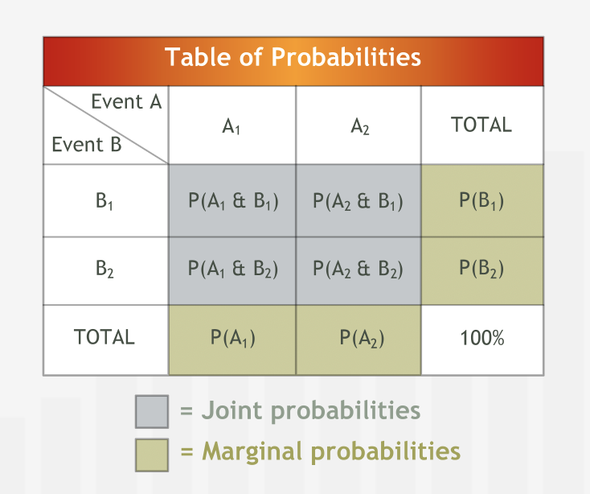
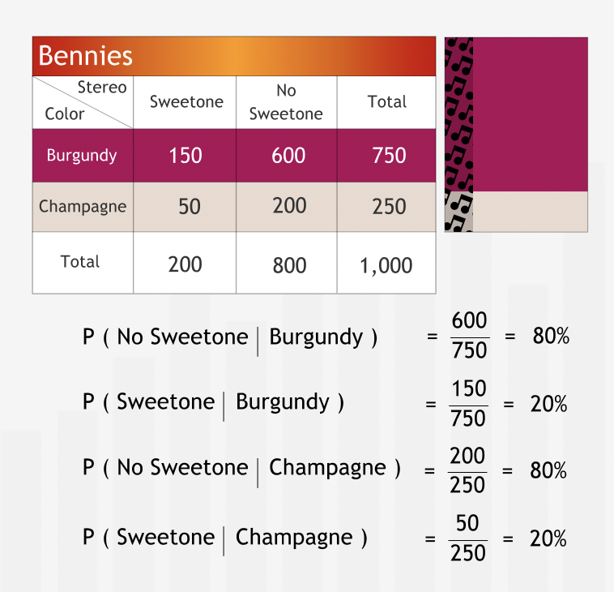
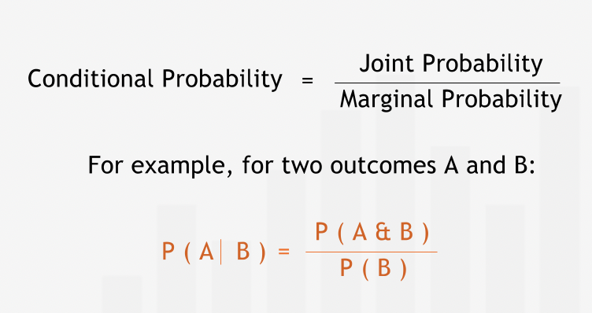
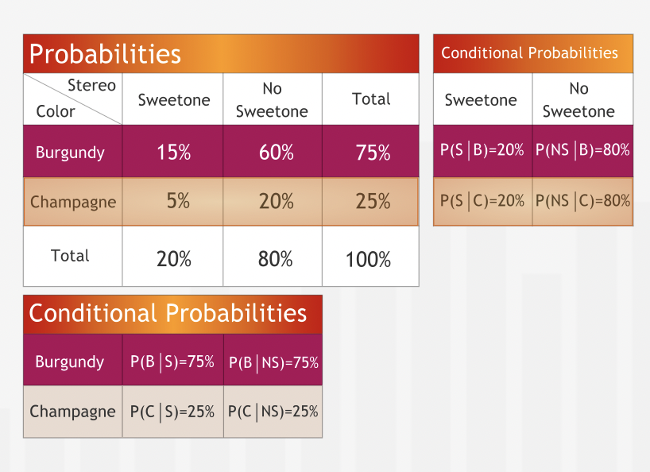
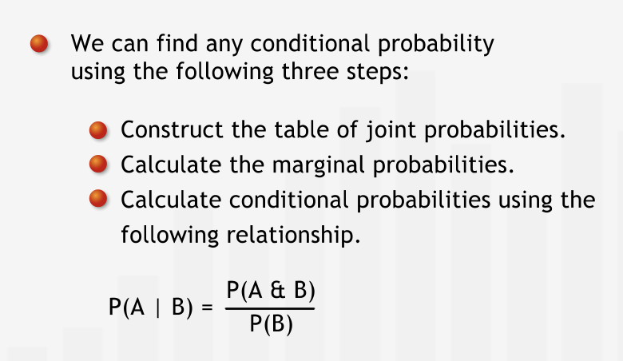
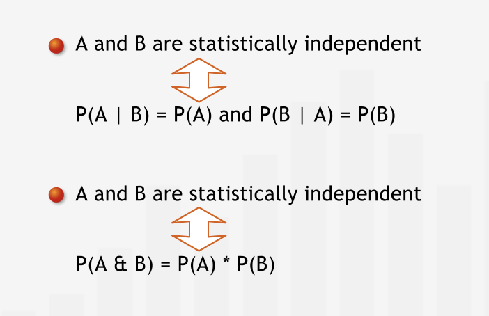

# Decision Analysis II

## Conditional Probabilities

### Joint & Marginal Probabilities

- **"The table is a useful tool for calculating proportions of potential interest to managers."**
- **"We can create an entire table of proportions. These proportions can be interpreted as probabilities."**
- "Probability" and "Proportion" are used interchangeably.
- The probabilities on the inside of the table are called joint probabilities. While the probabilties related to totals are called marginal probabilities.

- **"Information about the distribution of properties in populations is often available in terms of probabilities, so the table of probabilities is a very natural way to represent the data."**

#### Summary

- **"For two events A and B with outcomes A1, A2, etc. and B1, B2, etc., respectively, the joint probability P(A1 & B1) is the probability that the uncertain event A has outcome A1 and the uncertain event B has outcome B1. The joint probabilities of all possible outcomes of two uncertain events can be summarized in a probability table. The marginal probability of the outcome A1 of the first uncertain event is the sum of the joint probabilities of outcomes A1 and all possible outcomes B1, B2, etc. of the second uncertain event."**

#### Conditional Probabilities

- Probability of event A given event B is called caonditional probability.
- It is denoted as $P(A|B)$

- **"When given information as a table of probabilities, we can use the probabilities to calculate conditional probabilities as well: we simply form the ratios of the appropriate probabilities."**
- **"A conditional probability is formally defined in terms of the ratio of a joint probability to a marginal probability."**

- **" when presented with a decision problem in which the outcomes are influenced by multiple uncertain events, constructing the joint probabilities of these events is almost always a wise first step."**

##### Summary

- **The conditional probability P(A | B) is the probability of the outcome A of one uncertain event, given that the outcome B of a second uncertain event has already occurred. The table of joint probabilities provides all the information needed to compute all conditional probabilities. First calculate the marginal probabilities for each event, then compute the conditional probabilities as shown below:"**

#### Statistical Independence

- **"In general, we can interpret the fact that two uncertain events are independent in the following way: knowing that one event has occurred gives us no additional information about whether or not the other event has. For example, the results of two spins of a wheel of fortune are independent. The first result does not reveal anything about the second."**
- **"The joint probabilities are simply the products of the marginal probabilities."**
- **"Although it may seem plausible to assume that certain properties are independent, managers who take statistical independence for granted do so at their peril. We need to verify the assumption that the properties are independent by looking at and evaluating data or by proving independence on the theoretical level."**

##### Summary

- **"Two uncertain events A and B are said to be statistically independent if knowing that A has occurred does not tell us anything about the probability of B occurring, and vice versa. Statistical independence of two events can be demonstrated based on data or proved from theory; it should never be assumed. Events that are not statistically independent are said to be statistically dependent."**

