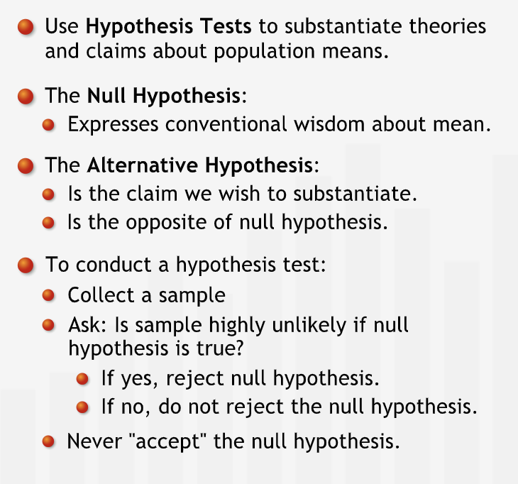
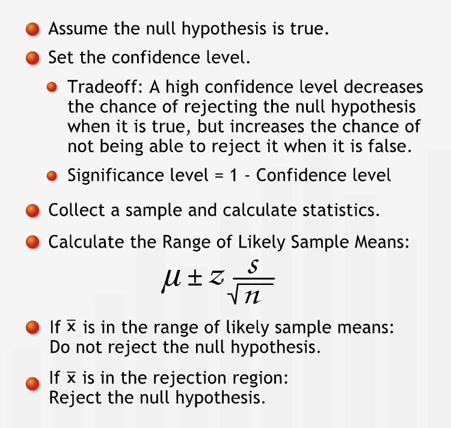
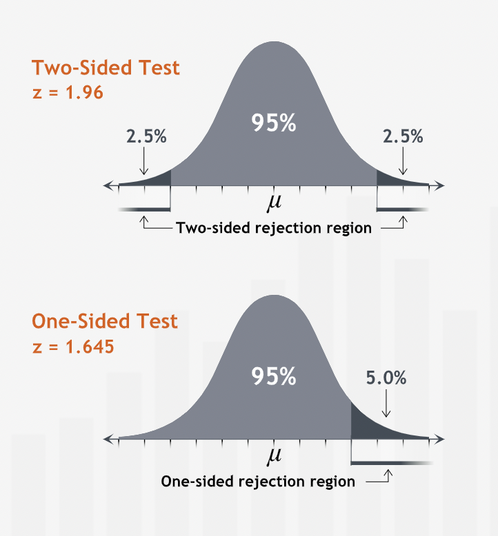
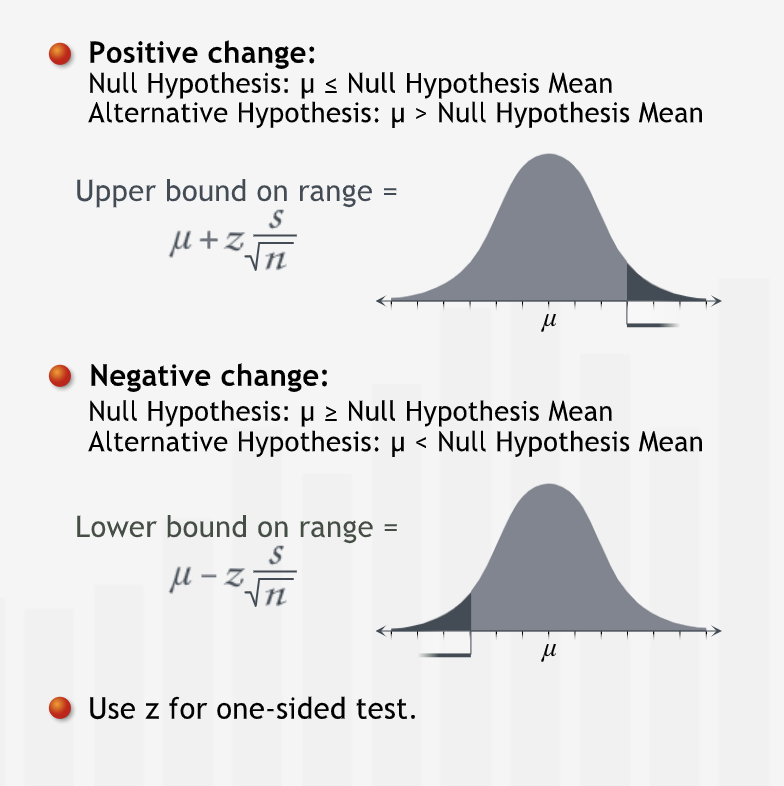

# Hypothesis Testing

## Introduction

### Definition

- **"As managers, we often need to put our claims, ideas, or theories to the test before we make important decisions. Based on whether or not our claim is statistically supported, we may wish to take managerial action."**
- **"Hypothesis testing is a statistical method for testing such claims. A hypothesis is simply a claim that we want to substantiate."**
- **"To conduct a hypothesis test, we formulate two hypotheses: the so-called null hypothesis and the alternative hypothesis."**
- A point estimate can be estimated using previous experience or conventional wisdom.
- **"The alternative hypothesis is the claim we are trying to substantiate. The alternative hypothesis states that the null hypothesis does not hold."**
- **"In a hypothesis test, we test the null hypothesis. Based on evidence we gather from a sample, there are only two possible conclusions we can draw from a hypothesis test: either we reject the null hypothesis or we do not reject it."**
- **"Since the alternative hypothesis states the opposite of the null hypothesis, by "rejecting" the null hypothesis we necessarily "accept" the alternative hypothesis."**
- We can never accept a null hypothesis.
- **"The only way we can substantiate our claim is to state it as the opposite of the null hypothesis, and then reject the null hypothesis based on the evidence."**
- **"In a hypothesis test, if our evidence is not strong enough to reject the null hypothesis, then that does not prove that the null hypothesis is true. We simply have failed to show it is false, and thus cannot reject it."**
- **"A hypothesis is a claim or assertion that can be tested. On the basis of a hypothesis test we either reject or leave unchallenged a particular statement: the null hypothesis."**

#### Summary

- **"We use hypothesis tests to substantiate a claim about a population mean. The null hypothesis states that the population mean is equal to an initial value that is based on our experience or conventional wisdom. We test the null hypothesis to learn if we should reject it in favor of our claim, the alternative hypothesis, which states that the null hypothesis does not hold."**

----

## Single Population Mean

### Hypothesis tests for Single Population Means

- **"The region outside the range of likely sample means is called the "rejection region," since we reject the null hypothesis if our sample mean falls into it."**
- **"If we take a sample, and the mean does not fall within the range around sample mean, we can reject the null hypothesis. Because if the population mean were equal to sample mean, it would be unlikely to collect a sample whose mean falls outside this range."**
- **"A hypothesis test with a 95% confidence level is said to have a 5% level of significance. A 5% significance level says that there is a 5% chance of a sample mean falling in the rejection region when the null hypothesis is true. This is what people mean when they say that something is "statistically significant" at a 5% significance level."**
- **"We need to choose the confidence level of our test based on the relative costs of making each type of error."**

#### Summary

- **In a hypothesis test for population means, we assume that the null hypothesis is true. Then, we construct a range of likely sample means around the null hypothesis mean. If the sample mean we collect falls in the rejection region, we reject the null hypothesis. Otherwise, we cannot reject the null hypothesis. The confidence level measures how confident we are that we are justified in rejecting the null hypothesis."**

#### One-sided Hypothesis Test

- We may want to know if the actual population mean differs from our initial value of the population mean in a specific direction. For such of type of cases one-sided hypothesis tests are used.

##### Summary

- **"When we want to test for change in a specific direction, we use a one-sided test. Instead of finding a range containing 95% of all sample means centered at the null hypothesis mean, we find a one-sided range. We calculate its endpoint using the cumulative probability under the normal curve."**

