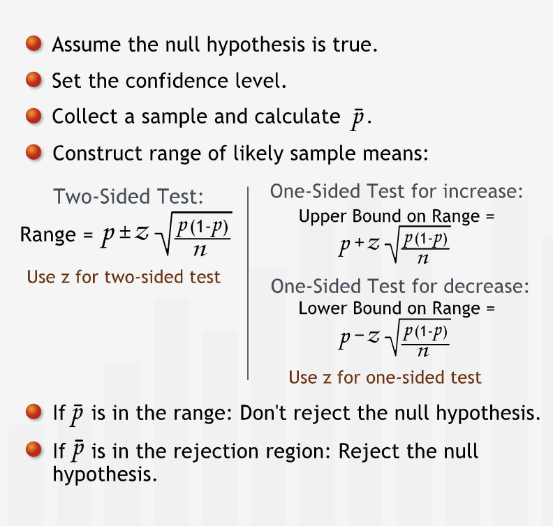
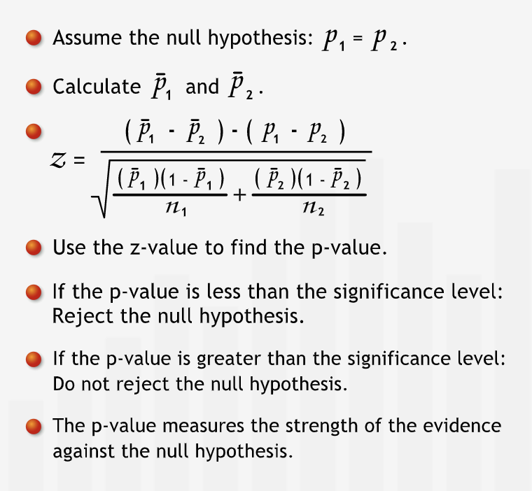

# Hypothesis Testing

## Introduction

### Definition

- **"As managers, we often need to put our claims, ideas, or theories to the test before we make important decisions. Based on whether or not our claim is statistically supported, we may wish to take managerial action."**
- **"Hypothesis testing is a statistical method for testing such claims. A hypothesis is simply a claim that we want to substantiate."**
- **"To conduct a hypothesis test, we formulate two hypotheses: the so-called null hypothesis and the alternative hypothesis."**
- A point estimate can be estimated using previous experience or conventional wisdom.
- **"The alternative hypothesis is the claim we are trying to substantiate. The alternative hypothesis states that the null hypothesis does not hold."**
- **"In a hypothesis test, we test the null hypothesis. Based on evidence we gather from a sample, there are only two possible conclusions we can draw from a hypothesis test: either we reject the null hypothesis or we do not reject it."**
- **"Since the alternative hypothesis states the opposite of the null hypothesis, by "rejecting" the null hypothesis we necessarily "accept" the alternative hypothesis."**
- We can never accept a null hypothesis.
- **"The only way we can substantiate our claim is to state it as the opposite of the null hypothesis, and then reject the null hypothesis based on the evidence."**
- **"In a hypothesis test, if our evidence is not strong enough to reject the null hypothesis, then that does not prove that the null hypothesis is true. We simply have failed to show it is false, and thus cannot reject it."**
- **"A hypothesis is a claim or assertion that can be tested. On the basis of a hypothesis test we either reject or leave unchallenged a particular statement: the null hypothesis."**

#### Summary

- **"We use hypothesis tests to substantiate a claim about a population mean. The null hypothesis states that the population mean is equal to an initial value that is based on our experience or conventional wisdom. We test the null hypothesis to learn if we should reject it in favor of our claim, the alternative hypothesis, which states that the null hypothesis does not hold."**

----

## Single Population Mean

### Hypothesis tests for Single Population Means

- **"The region outside the range of likely sample means is called the "rejection region," since we reject the null hypothesis if our sample mean falls into it."**
- **"If we take a sample, and the mean does not fall within the range around sample mean, we can reject the null hypothesis. Because if the population mean were equal to sample mean, it would be unlikely to collect a sample whose mean falls outside this range."**
- **"A hypothesis test with a 95% confidence level is said to have a 5% level of significance. A 5% significance level says that there is a 5% chance of a sample mean falling in the rejection region when the null hypothesis is true. This is what people mean when they say that something is "statistically significant" at a 5% significance level."**
- **"We need to choose the confidence level of our test based on the relative costs of making each type of error."**

#### Summary

- **In a hypothesis test for population means, we assume that the null hypothesis is true. Then, we construct a range of likely sample means around the null hypothesis mean. If the sample mean we collect falls in the rejection region, we reject the null hypothesis. Otherwise, we cannot reject the null hypothesis. The confidence level measures how confident we are that we are justified in rejecting the null hypothesis."**

#### One-sided Hypothesis Test

- We may want to know if the actual population mean differs from our initial value of the population mean in a specific direction. For such of type of cases one-sided hypothesis tests are used.

##### Summary

- **"When we want to test for change in a specific direction, we use a one-sided test. Instead of finding a range containing 95% of all sample means centered at the null hypothesis mean, we find a one-sided range. We calculate its endpoint using the cumulative probability under the normal curve."**

## Single Population Proportions

### Hypothesis Tests for Single Population Porpotions

- **"hypothesis tests for proportions are much like hypothesis tests for means."**
- Earlier formula are used, just that mean is replaced with proportions.
- **"The null hypothesis for a proportion test states the initial understanding. The alternative hypothesis is the claim we are using the hypothesis test to substantiate. The alternative hypothesis typically states the opposite of the null hypothesis: it states that our initial understanding is incorrect."**
- **"As with population means, we collect a random sample and calculate the sample proportion, "p-bar." However, for a hypothesis test about a population proportion, we don't need to calculate a standard deviation from the sample."**

#### Summary

- **"In a hypothesis test for population proportions, we assume that the null hypothesis is true. Then, we construct a range of likely sample proportions around the null hypothesis proportion. If the sample proportion we collect falls in the rejection region, we reject the null hypothesis. Otherwise, we cannot reject the null hypothesis."**

## P-values

### P-values

- P-values measures the strength of evidence against a null hypothesis.
- **"The confidence level tells us the significance level of the test, which is simply 1 minus the confidence level."**
- **"P-value tells us how likely it is to collect a sample mean that falls at least a certain distance from the null hypothesis mean."**
- **"In the familiar hypothesis testing procedure, if the p-value is less than our threshold of 5%, we reject our null hypothesis."**
- **"The p-value does more than simply answer the question of whether or not we can reject the hypothesis. It also indicates the strength of the evidence for rejecting the null hypothesis. For example, if the p-value is 0.049, we barely have enough evidence to reject the null hypothesis at the 0.05 level of significance; if it is 0.001, we have strong evidence for rejecting the null hypothesis."**
- **"the lower the p-value, the higher our confidence in rejecting the null hypothesis."**
- **"For one-sided tests, the p-value is the area under one side of the curve."**

#### Summary

- **"The p-value measures the strength of the evidence against the null hypothesis. It is the likelihood, assuming that the null hypothesis is true, of collecting a sample mean at least as far from the null hypothesis mean as the sample actually collected. We compare the p-value to the threshold significance level to make a reject/not reject decision. The p-value also tells us how comfortable we can be with that decision."**

## Comparing Two Populations

### Using Hypothesis Tests to Compare Two Population Means

- **"We conduct two-population tests to compare a characteristic of two groups for which we have access to sample data for each group."**
- **"In two-population tests, we take two samples, one from each population. For each sample, we calculate the sample mean, standard deviation, and sample size. We can then use the two sets of sample data to test claims about differences between the two populations. "**

- **"The null hypothesis states that there is no difference in the two population means. As with single-population tests, we test the null hypothesis by asking how likely it would be to produce the sample results if the null hypothesis is in fact true."**

#### Summary

- **"In a hypothesis test for two population means, we assume a null hypothesis: that the two population means are equal. We collect a sample from each population and calculate its sample statistics. We calculate a p-value for the difference between the two samples. If the p-value is less than the significance level, we reject the null hypothesis."**

## Hypothesis Tests for Two Population Proportions

- **"Comparing two population proportions is similar to comparing two population means. We have two populations: the null hypothesis states that their proportions are the same; the alternative hypothesis states that they are different."**
- **"We collect a sample from each population and calculate its sample size and sample proportion. As in the single population proportion test, we don't need to find the sample standard deviation, since we know that the population standard deviation is the square root of $[p*(1 - p)].$"**

- **"We translate the z-value into a p-value just as we would for any other type of hypothesis test. If the p-value is less than our significance level, we reject the null hypothesis and conclude that the proportions are different. If the p-value is greater than the significance level, we do not reject the null hypothesis."**

### Summary

- **"In a hypothesis test for two population proportions, we assume a null hypothesis: the two population proportions are equal. We collect two samples and calculate the sample proportions. We calculate a p-value for the difference between the sample proportions. If the p-value is less than the significance level, we reject the null hypothesis."**

