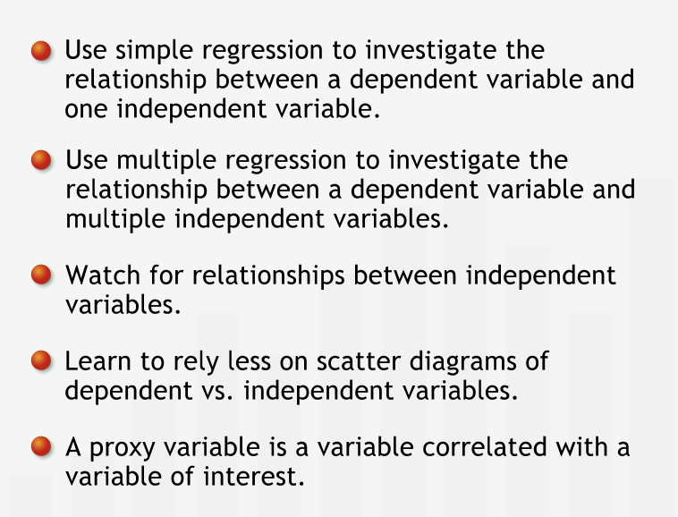
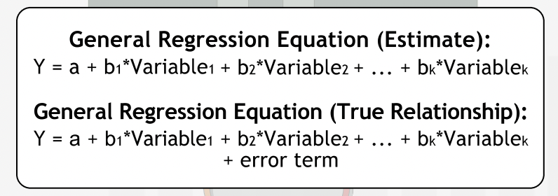
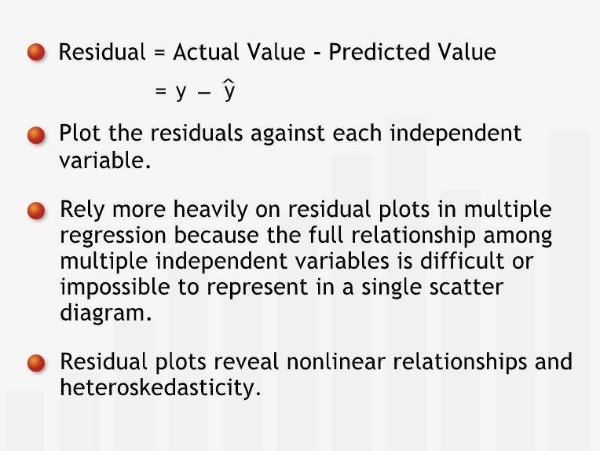
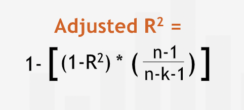
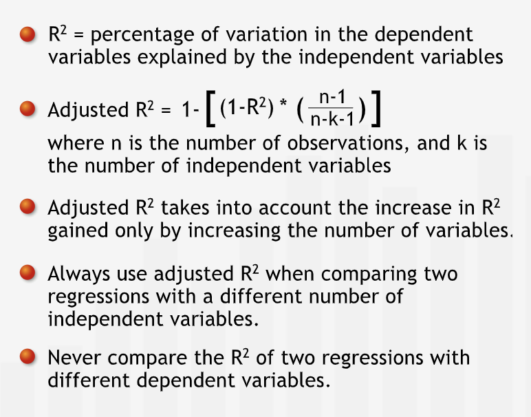
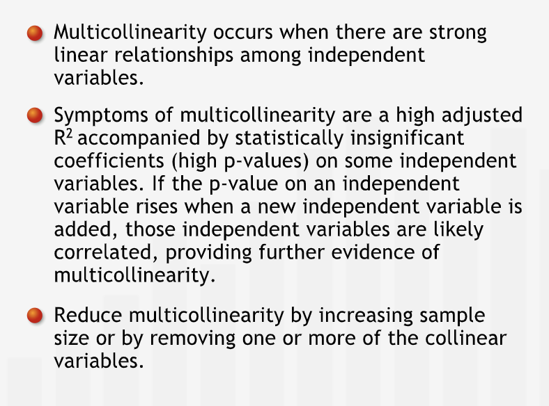
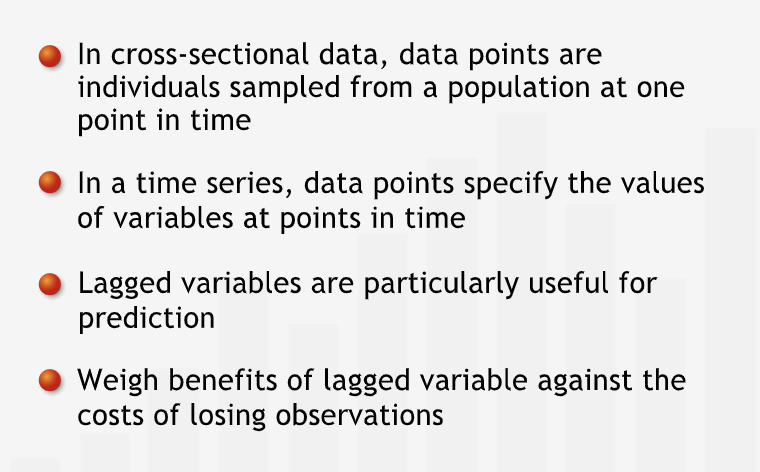
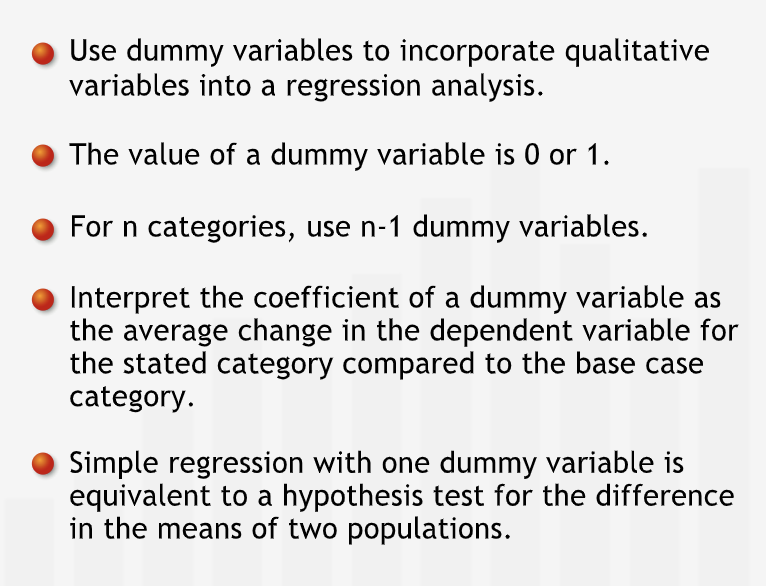

# Multiple Regression

## Introduction

### Introducing Multiple Regression

- **"Most management problems are too complex to be completely described by the interactions between only two variables. Incorporating multiple independent variables can give managers a more accurate mathematical representation of their business."**
- It is necessary to factor any relationship between two or more independent variables in regression analysis. This can be achieved by multiple regression. 
- **" In multiple regression, we adapt what we know about regression with one independent variable — often called simple regression — to situations in which we take into account the influence of several variables."**
- Visualization and graphical representation become essentially impossible beyond three variables.
- **"As managers, almost any quantity we wish to study will be influenced by more than one variable: to construct an accurate model of a business' dynamics, we'll usually need several variables. Multiple regression is an essential and powerful management tool for analyzing these situations."**

#### Summary

- **"Multiple regression is an extension of simple regression that allows us to analyze the relationships between multiple independent variables and a dependent variable. Relationships among independent variables complicate multivariate regression. With more than two independent variables, graphing multivariable relationships is impossible, so we must proceed with caution and conduct additional analyses to identify patterns."**

---

## Adapting Basic Concepts

### Interpreting the Multiple Regression Equation

- **"In general, the linear equation for a regression model with k different variables has the form below. Since the coefficients we obtain from the data are just estimates, we must distinguish between the idealized equation that represents the "true" relationship and the regression line that estimates that relationship. To express that even the "true" equation does not fit perfectly, we include an error term in the idealized equation."**

- **"The coefficient in the simple regression and the coefficient in the multiple regression have very different meanings."** In the simple regression equation of dependent variable versus independent variable, we interpret the coefficien of slope in the following way: for a unit increase in the independent variable, we expect dependent variable to increase/decrease by the coefficient of slope (positive/negative).
- We describe the above change in dependent variable as gross effect. It is an average computed over the range of variation of all other factors that influence dependent variable.
- In multiple regression, the coefficient for an independent variable tells us that for every unit change in independent variable, dependent variable change by coefficient provided other independent variables remain constant.
- We describe the above change in dependent variable as net effect. It is the effect of the independent variable under consideration over dependent variable controlling other independent variables.
- **"A coefficient is "net" with respect to all variables included in the regression, but "gross" with respect to all omitted variables. An included variable may be picking up the effects on price of a variable that is not included in the model."**
- **"For each independent variable, we must inspect its p-value in the regression output to make sure that its relationship with the dependent variable is significant."**

#### Summary

- **"We use multiple regression to understand the structure of relationships between multiple variables and a dependent variable, and to forecast values of the dependent variable. A coefficient for an independent variable in a regression equation characterizes the net relationship between the independent variable and the dependent variable: the effect of the independent variable on the dependent variable when we control for the other independent variables included in the regression."**

### Residual Analysis

- **"The regression equation with two independent variables defines a plane that passes through the data. The residuals — the differences between the actual and predicted dependent variable in the data set — are the vertical distances from the regression plane to the data points."**
- **"As in simple regression, these vertical distances are known as residuals or errors. The regression plane is the plane that "best fits" the data in the sense that it is the plane for which the sum of the squared errors is minimized."**
- **"We can plot the residuals against the values of each independent variable to look for patterns that could indicate that our linear regression model is inadequate in some way."**
- **"When linear regression is a good model for the relationships studied, each of the residual plots should reveal a random distribution of the residuals. The distribution should be normal, with mean zero and fixed variance."**
- **"The residual plot against distance in the multiple regression looks different from the residual plot against distance in the simple regression. They represent different concepts: the first gives insight into the net relationship and the second gives insight into the gross relationship."**
- **"Because residual plots always involve only two variables — the magnitude of the residual and one of the independent variables — they provide an indispensable visual tool for detecting patterns such as heteroskedasticity and non-linearity in regressions with multiple independent variables."**

#### Summary

- **"The residuals, or errors, are the differences between the actual values of the dependent variable and the predicted values of the dependent variable. For a regression with two independent variables, the residuals are the vertical distances from the regression plane to the data points. We can graph a residual plot for each independent variable to help identify patterns such as heteroskedasticity or non-linearity."**

### Quantifying the Predictive Power of Multiple Regression

- In multiple regression, R squared measures the percentage of variation in dependent variable explained by the variation in the independent variable.
- **"R-squared cannot decrease when we add another independent variable to a regression — it can only stay the same or increase, even if the new independent variable is completely unrelated to the dependent variable."**
- **"Improving R-squared by adding irrelevant variables is "cheating." We can always increase R-squared to 100% by adding independent variables until we have one fewer than the number of observations. We are "over-fitting" the data when we obtain a regression equation in this way: the equation fits our particular data set exactly, but almost surely does not explain the true relationship between the independent and dependent variables."**
- **"To balance out the effect of the difference between the number of observations and the number of independent variables, we modify R-squared by an adjustment factor. This transformation looks quite complicated, but notice that it is largely determined by n-k, the difference between the number of observations n and the number of independent variables k."**

- **"This adjustment reduces R-squared slightly for each variable we add: unless the new variable explains enough additional variance to increase R-squared by more than the adjustment factor reduces it, we should not add the new variable to the model."**
- **"It is critical to use adjusted R-squared when comparing the predictive power of regressions with different numbers of independent variables."**
- **"We should never compare R-squared or adjusted R-squared values for regressions with different dependent variables."**

#### Summary

- **"R-squared measures how well the behavior of the independent variables explains the behavior of the dependent variable. It is the percentage of variation in the dependent variable explained by its relationship with the independent variables. Because R-squared never decreases when independent variables are added to a regression, we multiply it by an adjustment factor. This adjustment balances out the apparent advantage gained just by increasing the number of independent variables."**

---

## New Concepts in Multiple Regression

### Multicollinearlity

- **"When two of the independent variables are highly correlated, one is essentially a proxy for the other. This phenomenon is called multicollinearity."**

#### Diagnosing and Treating Multicollinearity

- **"A common indication of lurking multicollinearity in a regression is a high adjusted R-squared value accompanied by low significance for one or more of the independent variables. One way to diagnose multicollinearity is to check if the p-value on and independent variable rises when a new independent variable is added, suggesting strong correlation between those independent variables."**
- **"How much of a problem is multicollinearity? That depends on what we are using the regression analysis for. If we're using it to make predictions, multicollinearity is not a problem, assuming as always that the historically observed relationships among the variables continue to hold going forward."**
- **"If we're trying to understand the net relationships of the independent variables, multicollinearity is a serious problem that must be addressed."**
- **"One way to reduce multicollinearity is to increase the sample size. The more observations we have, the easier it will be to discern the net effects of the individual independent variables. We can also reduce or eliminate multicollinearity by removing one of the collinear independent variables. Identifying which variable to remove requires a careful analysis of the relationships between the independent variables and the dependent variable. This is where a manager's deep understanding of the dynamics of the situation becomes invaluable."**

#### Summary

- **"Multicollinearity occurs when some of the independent variables are strongly interrelated: distinguishing the respective effects of some of the independent variables on the dependent variable is not possible using the available data. Multicollinearity is typically not a problem when we use regression for forecasting. When using regression to understand the net relationships between independent variables and the dependent variable, multicollinearity should be reduced or eliminated."**

#### Lagged Variables

- Data at a specific point in time is called cross-sectional data.
- **"A time series is a set of data collected over a range of time: each data point pertains to a specific time period."**
- **"Sometimes, the value of the dependent variable in a given period is affected by the value of an independent variable in an earlier period. We incorporate the delayed effect of an independent variable on a dependent variable using a lagged variable."**
- **"To study the carry-over effect, we add the lagged variable "previous year's advertising.""**
- We lose some data point(s) by introducing lagged variables.
- **"We include a lagged variable only if we believe the benefits of adding it outweigh the loss of an observation and the "penalty" imposed by the adjustment to R-squared."**
- **"Lagged variables can be very useful. Since they pertain to previous time periods, they are usually available ahead of time. Lagged variables are often good "leading indicators" that help us predict future values of a dependent variable."**

##### Summary

- **"We can use lagged variables when data consist of a time series, and we believe that the value of the dependent variable at one point in time is related to the value of an independent variable at a previous point in time. Lagged variables are especially useful for prediction since they are available ahead of time. However, they come at a cost: we lose one observation for each time series interval of delayed effect we incorporate into the lagged variable."**

#### Dummy Variables

- Variable which can be quantified but can be classified in to categories are called categorical variables.
- **"A dummy variable takes on one of two values, 0 or 1, to indicate which of available categories a data point falls into."**
- **"In general, we'd need one fewer dummy variable than the number of categories."**
- Perfectly correlated variables are perfectly collinear and hence it is better to drop variables to avoid multicollinearity.

##### Summary

- **"We can use dummy variables to incorporate qualitative variables into a regression analysis. Dummy variables have the values 0 and 1: the value is 1 when an observation falls into a category of the qualitative variable and 0 when it doesn't. For qualitative variables with more than two categories, we need multiple dummy variables: one fewer than the number of categories."**
