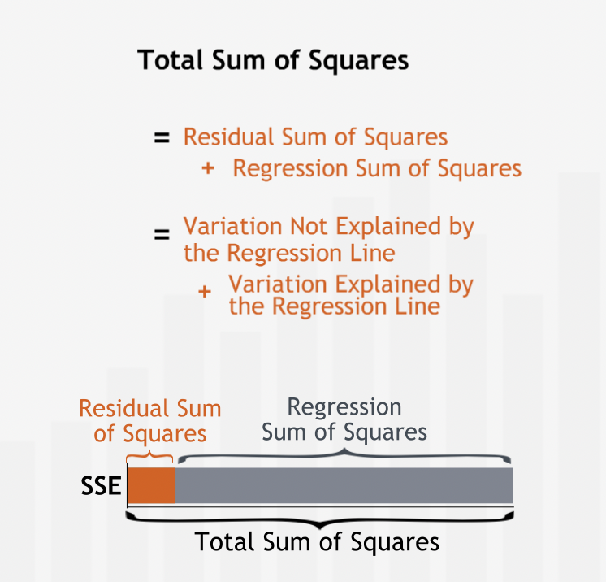

# Regression Basics

## Introduction

### Introducing the Regression Line

- Scatter plot can help us visualize relationships between variables.
- Correlation coefficient can help us measure the strength of the linear relationship.
- **"Regression understand and characterize the specific structure of the relationship between two variables."**
- **"One of these lines most accurately describes the relationship between the two variables: the "best-fit" or regression line."**
- **"In general, a regression line can be described by a simple linear equation: $y = a + bx$, with y-intercept a and slope b."**
- **"In this equation, the y-variable  is called the dependent variable. The x-variable, advertising, is called the independent variable, or the explanatory variable."**
- **"When we observe that a change in the independent variable is typically accompanied by a proportional change in the dependent variable, regression analysis can identify and formalize that relationship."**

#### Summary

- **"Regression analysis helps us find the mathematical relationship between two variables. We can use regression to describe a linear relationship: one that can be represented by a straight line and characterized by an equation of the form $y = a + bx$."**

### The uses of Regression

- Regression can help is two ways:
  - Forecasting: prediction of future values based on current values.
  - Deepen our understanding of the structure of the relationship between two variables by expressing the relationship mathematically.

#### Using Regression for Forecasting

- **"Regression analysis brings the entire data set to bear on our prediction. Having identified the relationship between the two variables from the full data set, we can apply our understanding of that relationship to our forecast."**
- With regression, we can forecast within the range of observed values only. Be extremely cautious about forecasting beyond the observed values range.
- **"If we try to use our regression equation to forecast sales for advertising levels outside of the historical range, we are implicitly assuming that the relationship between advertising and sales continues to be linear outside of the historical range."**
- **"Another critical caveat to keep in mind is that whenever we use historical data to predict future values, we are assuming that the past is a reasonable predictor of the future. Thus, we should only use regression to predict the future if the general circumstances that held in the past, such as competition, industry dynamics, and economic environment, are expected to hold in the future."**

#### The Structure of a Relationship

- **"Regression can be used to deepen our understanding of the structural relationship between two variables."**
- **"Understanding "the structure" of any relationship translates into finding and interpreting the coefficients of the regression equation."**
- **"The regression line gives us insight into how two variables are related. As one variable increases, by how much does the other variable typically change?"**

#### Summary

- **"We use regression analysis for two primary purposes: forecasting and studying the structure of the relationship between two variables. We can use regression to predict the value of the dependent variable for a specified value of the independent variable. The regression equation also tells us how the dependent variable has typically changed with changes in the independent variable."**

---

## Calculating the Regression Line

### The Accuracy of Line

- **"A regression line helps you understand the relationship between two variables and forecast future values of the dependent variable."**
- **"The regression line depicts the best linear relationship between the two variables. We attribute the difference between the actual data points and the line to the influence that other variables have on sales, or to chance alone."**
- **"To quantify how accurately a line fits a data set, we measure the vertical distance between each data point and the line."**
- **"We measure vertical distance because we are interested in how well the line predicts the value of the dependent variable. The dependent variable is measured on the vertical axis. For each data point, we want to know how close the value of sales predicted by the line is to the historically observed value of sales."**
- **"Vertical distance between a data point and the line is the error in prediction or the residual error, or simply the error. The error is the difference between the observed value and the line's prediction for our dependent variable. This difference may be due to the influence of other variables or to plain chance."**

- To quantity the total error, individuals errors are squared and then added with each other so that positive and negative errors do not cancel out each other. This measure is called Sum of Squared Error (SSE) or the Residual Sum of Squares, gives us a good measure of how accurately a line describes a set of data.
- **"The less well the line fits the data, the larger the errors, and the higher the Sum of Squared Errors."**

#### Summary

- **"To find the line that best fits a data set, we first need a measure of the accuracy of a line's fit: the Sum of Squared Errors. To find the Sum of Squared Errors, we calculate the vertical distances from the data points to the line, square the distances, and sum the squares."**

### Identifying the Regression Line

- Regression line is the line with smalleest SSE.
- **"The lower the Sum of Squared Errors, the more precisely the line fits the data, and the higher the line's accuracy."**

#### Summary

- **"The line that most accurately fits the data — the regression line — is the line for which the Sum of Squared Errors is minimized."**

---

## Deeper into Regression

### Quantifying the Predictive Power of Regression

- Mean can be used as a benchmark to compare the predictive power of regression line.
- The Sum of Squared Errors for the mean line measures the total variation in the dependent variable data. In fact, it is the same measure of variation we use to derive the standard deviation of dependent variable.
- **"We call the Sum of Squared Errors for our benchmark, the Total Sum of Squares."**
- **"The Sum of Squared Errors for the regression line is often called the Residual Sum of Squared Errors, or the Residual Sum of Squares. The Residual Sum of Squares is the variation left "unexplained" by the regression."**
- The difference between the Total Sum of Squares and the Residual Sum of Squares is called the Regression Sum of Squares. The Regression Sum of Squares measures the variation in dependent variable "explained" by the regression line.

- **"A standardized measure of the regression line's explanatory power is called R-squared. R-squared is the fraction of the total variation in the dependent variable that is explained by the regression line."**
- **"R-squared will always be between 0 and 1 — at worst, the regression line explains none of the variation in dependent variable; at best it explains all of it."**
- **"We find R-squared by dividing the variation explained by the regression line — the Regression Sum of Squares — by the total variation in the dependent variable — the Total Sum of Squares."**

- $Fraction\_of\_variation\_not\_explained = \frac{residual\_sum\_of\_sqaures}{total\_sum\_of\_sqaures}$
- **"In a regression that has only one independent variable, R-squared is closely related to the correlation coefficient between the independent and dependent variables: the correlation coefficient is simply the positive or negative square root of R-squared—positive if the slope of the regression line is positive and negative if the slope of the regression line is negative."**

#### Summary

- **"R-squared measures how well the behavior of the independent variable explains the behavior of the dependent variable. R-squared is the ratio of the Regression Sum of Squares to the Total Sum of Squares. As such, it tells us what proportion of the total variation in the dependent variable is explained by its linear relationship with the independent variable."**

### Residual Analysis

- **"The vertical distances from the data to the line — the errors — measure how well the line fits the data. These errors are also known as residuals."**
- Residual plot (independent variable vs residual error) helps us identify patterns in the residuals.
- **"A residual plot often is better than the original scatter plot for recognizing patterns because it isolates the errors from the general trend in the data. Residual plots are critical for studying error patterns in more advanced regressions with multiple independent variables."**
- **"If the only pattern in the dependent variable is accounted for by a linear relationship with the independent variable, then we should see no systematic pattern in the residual plot. The residuals should be spread randomly around the horizontal axis."**
- **"The distribution of the residuals should be a normal distribution, with mean zero, and a fixed variance. Residuals are called homoskedastic if their distributions have the same variance."**
- **"If we see a pattern in the distribution of the residuals, then we can infer that there is more to the behavior of the dependent variable than what is explained by our linear regression. Other factors may be influencing the dependent variable, or the assumption that the relationship is linear may be unwarranted."**
- **"When the residuals appear to be getting larger for higher values of the independent variable. This phenomenon is known as heteroskedasticity."**
- **"Residual analysis reveals that the distribution of the residuals changes with the independent variable: the variance increases as the independent variable increases. Since the variance of the residuals — which contributes to the variation of the dependent variable — is affected by the behavior of the independent variable, we can conclude that there must be more to the story than just the linear relationship."**

#### Summary

- **"A complete regression analysis should include a careful inspection of the residuals. Plot the residuals against the independent variable to reveal patterns in the distribution of the residuals."**

