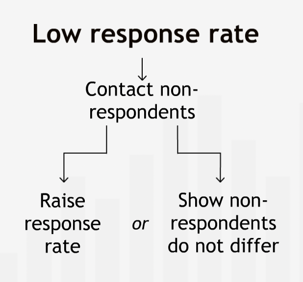
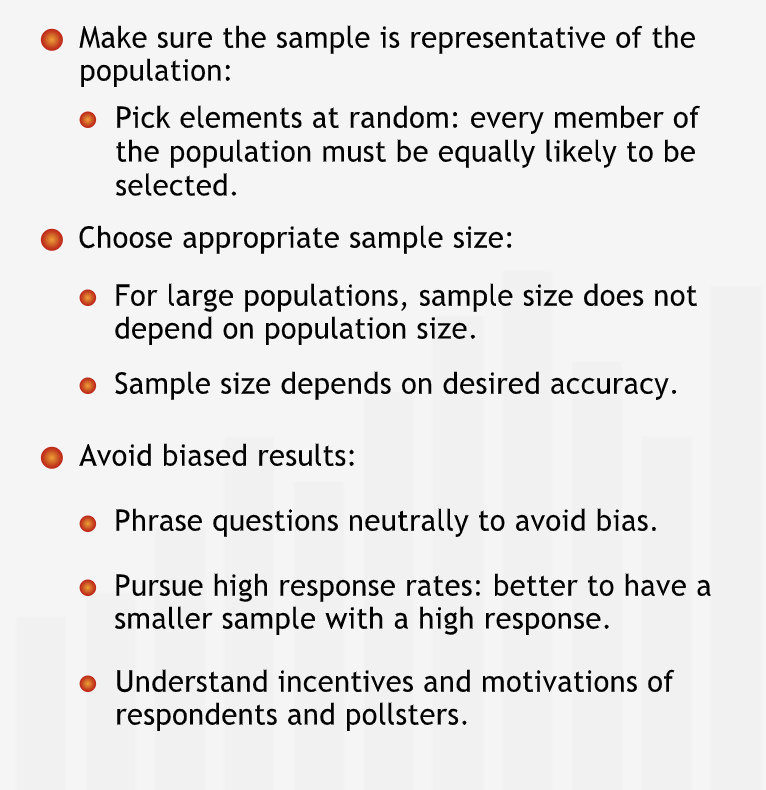
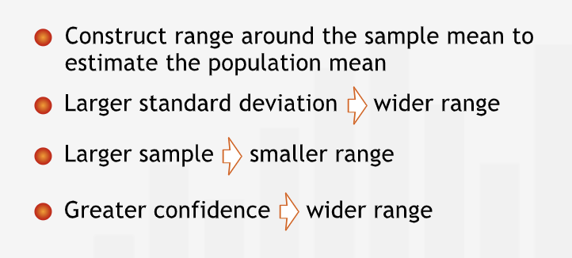
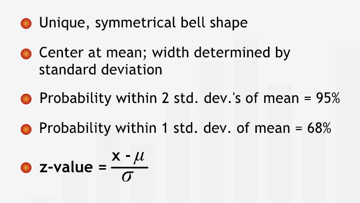

# Sampling and Estimation

## Generating Random Samples

- Complete population can not be used for statistical inference. Hence a sample is chosen in such a way that it represents the population.

### How to Create a Representative and Unbiased Sample

- **"When it is too costly to gather the information we want to know about every person or every thing in an entire group, we often ask the question of a subset, or sample of the group. We then try to use that information to draw conclusions about the whole group."**
- General structure that is followed to infer
  - Select elements from the population at random
  - Analyze that sample
  - Draw inference about the total population

#### Taking a Random Sample

- **"The first trick to sampling is to make sure we select a sample that broadly represents the entire group we're interested in."**
- **"To get a good sample, we must make sure we select the sample "at random" from the full population. This means that every person or thing in the population is equally likely to be selected."**
- Selecting a sample is a challeneging exercise.
- It is easier to select a sample from a known population that selecting a sample from an unknown population.

#### Sample Size

- After selecting how to select a sample, decide on how much to select for a sample i.e. the size of sample.
- The size of the sample is dependent upon the required accuracy of any estimate.
- Any sample can give us a satisfactiry estimation as long as it is representative of the entire population.
- **"It's important to understand that the sample size depends on the level of accuracy we require, not on the size of the population."**

#### Learning about a sample

- **"Once we select our sample, we need to make sure we obtain accurate information about each member of the sample."**
- **"When we want to learn something about a group of people and don't have any existing data, we often use a survey to learn about an issue of interest. Conducting a survey raises problems that can be surprisingly tricky to resolve."**
  - **"First, how do we phrase our questions? Is there a bias in any questions that might lead participants to answer them in a certain way? Are any questions worded ambiguously? If some of the people in the sample interpret a question one way, and others interpret it differently, our results will be meaningless!"**
  - **"Second, how do we best conduct the survey? Should we send the survey in the mail, or conduct it over the phone? Should we interview survey participants in person, or distribute handouts at a meeting?"**
- Weigh the pros and cons of each method of survey to serve the purpose. **"Every survey will have different issues that we need to confront before going into the field to collect the data."**

#### Response Rates

- **"We have to be sure that those who respond to the survey answer questions in much the same way as those who don't respond would answer them. Otherwise, we will have a biased view of what the whole population thinks."**
- **"Surveys with low response rates are particularly susceptible to bias. If we get a low response rate, we must try to follow up with the people who did not respond the first time. We either need to increase the response rate by getting answers from those who originally did not respond, or we must demonstrate that the non-respondents' opinions do not differ from those of the respondents on the issue of interest."**

- **"Tracking down everyone in a sample and getting their response can be costly and time consuming. When our resources are limited, it is often better to take a small sample and relentlessly pursue a high response rate than to take a larger sample and settle for a low response rate."**

#### Summary

- **"Often it makes sense to infer facts about a large population from a smaller sample. To make sound inferences:"**

#### Classic sampling mistakes

- Following are classic sampling mistakes
  - Unrepresentative sample
  - Low response rate
  - Biased respondents
  - Biased questions
- **"How data are collected is at least as important as how data are analyzed. A sample that is unrepresentative, biased, or not drawn at random can give highly misleading results."**

## The Population Mean

- **"The sample mean is the best point estimate of the population mean, but it cannot tell you how accurately the sample reflects the population."**

### Using Confidence Intervals

- **"We need to have a sense of how close or far away the true population mean might be from our estimate."**
- We can construct a range around the point estimate to convey about the accuracy of the estimate.
- To calculate the range we need - sample mean ($\bar{x}$), sample standard deviation ($s$), sample size ($n$) and confidence level ($z$).

- Sample mean should always be the center of the range as it is the best estimate.
- **"The width of the range depends on the standard deviation of the sample. When the sample standard deviation is large, we have greater uncertainty about the accuracy of the sample mean as an estimate of the population mean. Thus, we have to create a wider range to be confident that it includes the true population mean. On the other hand, if the sample standard deviation is small, we feel more confident that our sample mean is an accurate predictor of the true population mean."**
- **"The width of the range depends on the sample size. With a very small sample, it's quite possible that one or two atypical points in the sample could throw the sample mean off considerably from the true population mean. So with a small sample, we need to create a wide range to feel comfortable that the true mean is likely to be inside it. The larger the sample, the more certain we can be that the sample mean represents the population mean. Thus, with a large sample, we can feel comfortable with a small range."**
- **"The width of the range depends on our desired level of confidence. The level of confidence states how certain we want to be that the range contains the mean of the population. The more confident we want to be that the range contains the true population mean, the wider we have to make the range."**
- **"In the language of statistics, we indicate our level of confidence by saying, for example, that we are "95% confident" that the range contains the true population mean. This means there is a 95% chance that the range contains the true population mean."**

### Summary

- **"The sample mean is our best initial estimate of the population mean. To indicate how accurate this estimate is, we construct a range around the sample mean that likely contains the population mean. The width of the range is determined by the sample size, sample standard deviation, and the level of confidence. The confidence level measures how certain we are that the range we construct contains the true population mean."**

## The Normal Distribution

- **"The normal distribution helps us create a range around a sample mean that is likely to contain the true population mean."**
- **The normal distribution is a probability distribution that is centered at the mean. It is shaped like a bell, and is sometimes called the "bell curve."**
- **"Like any probability distribution, the normal distribution is shown on two axes: the x-axis for the variable we're studying — women's heights, for example — and the y-axis for the likelihood that different values of the variable will occur."**
- **"As it turns out, for a probability distribution like the normal distribution, the percent of all values falling into a specific range is equal to the area under the curve over that range."**
- Total area under the curve is 1 or 100%.
- Specialities of normal distribution: 
  - Mean and median are equal.
  - Symmetrical shape around the mean. Width of the curve depends on the standard deviation. **"Large standard deviations make the curve very flat. Small standard deviations produce tight, tall curves with most of the values very close to the mean."**
  - 2/3rd or 68% of values lies within 1 standard deviation around the mean on either sides.
  - 95% of the values lies within 2 standard deviation away from the mean on either side.
  - These rules holds true for all normal distribution.
- A normal distribution is called standard normal distribution if mean id 0 and standard deviation is equal to 1.

### The z-statistic

- **"For a normal distribution, we usually refer to the number of standard deviations we must move away from the mean to cover a particular probability as "z", or the "z-value." For any value of z, there is a specific probability of being within z standard deviations of the mean."**
- **"To know how far you must go from the mean to cover a certain area under the curve, you have to know the standard deviation of the distribution."**
- **"Using the z-statistic, we can then "standardize" the distribution, making it into a standard normal distribution with a mean of 0 and a standard deviation of 1."**
- **"The z-statistic translates any value into its corresponding z-value simply by subtracting the mean and dividing by the standard deviation."**
- **"Essentially, the z-statistic allows us to measure the distance from the mean in terms of standard deviations instead of real values. It gives everyone the same size feet in statistics."**
- **"Sometimes we may want to go in the other direction, starting with the probability and figuring out how many standard deviations are necessary on either side of the mean to capture that probability."**
- **"probabilities are shown in other forms. If we start at the very left side of the distribution, the area underneath the curve is called the cumulative probability."**
- **"Cumulative probabilities can be used to find the probability of any range of values."**

### Summary

- **"The normal distribution has a unique symmetrical shape whose center and width are completely determined by its mean and its standard deviation. For every normal distribution, the probability of being within a specified number of standard deviations of the mean is the same. The distance from the mean, as measured in standard deviations, is known as the z-value. Using the properties of the normal distribution, we can calculate a probability associated with any range of values."**

