# Sampling and Estimation

## Generating Random Samples

- Complete population can not be used for statistical inference. Hence a sample is chosen in such a way that it represents the population.

### How to Create a Representative and Unbiased Sample

- **"When it is too costly to gather the information we want to know about every person or every thing in an entire group, we often ask the question of a subset, or sample of the group. We then try to use that information to draw conclusions about the whole group."**
- General structure that is followed to infer
  - Select elements from the population at random
  - Analyze that sample
  - Draw inference about the total population

#### Taking a Random Sample

- **"The first trick to sampling is to make sure we select a sample that broadly represents the entire group we're interested in."**
- **"To get a good sample, we must make sure we select the sample "at random" from the full population. This means that every person or thing in the population is equally likely to be selected."**
- Selecting a sample is a challeneging exercise.
- It is easier to select a sample from a known population that selecting a sample from an unknown population.

#### Sample Size

- After selecting how to select a sample, decide on how much to select for a sample i.e. the size of sample.
- The size of the sample is dependent upon the required accuracy of any estimate.
- Any sample can give us a satisfactiry estimation as long as it is representative of the entire population.
- **"It's important to understand that the sample size depends on the level of accuracy we require, not on the size of the population."**

#### Learning about a sample

- **"Once we select our sample, we need to make sure we obtain accurate information about each member of the sample."**
- **"When we want to learn something about a group of people and don't have any existing data, we often use a survey to learn about an issue of interest. Conducting a survey raises problems that can be surprisingly tricky to resolve."**
  - **"First, how do we phrase our questions? Is there a bias in any questions that might lead participants to answer them in a certain way? Are any questions worded ambiguously? If some of the people in the sample interpret a question one way, and others interpret it differently, our results will be meaningless!"**
  - **"Second, how do we best conduct the survey? Should we send the survey in the mail, or conduct it over the phone? Should we interview survey participants in person, or distribute handouts at a meeting?"**
- Weigh the pros and cons of each method of survey to serve the purpose. **"Every survey will have different issues that we need to confront before going into the field to collect the data."**

#### Response Rates

- **"We have to be sure that those who respond to the survey answer questions in much the same way as those who don't respond would answer them. Otherwise, we will have a biased view of what the whole population thinks."**
- **"Surveys with low response rates are particularly susceptible to bias. If we get a low response rate, we must try to follow up with the people who did not respond the first time. We either need to increase the response rate by getting answers from those who originally did not respond, or we must demonstrate that the non-respondents' opinions do not differ from those of the respondents on the issue of interest."**

- **"Tracking down everyone in a sample and getting their response can be costly and time consuming. When our resources are limited, it is often better to take a small sample and relentlessly pursue a high response rate than to take a larger sample and settle for a low response rate."**

#### Summary

- **"Often it makes sense to infer facts about a large population from a smaller sample. To make sound inferences:"**

#### Classic sampling mistakes

- Following are classic sampling mistakes
  - Unrepresentative sample
  - Low response rate
  - Biased respondents
  - Biased questions
- **"How data are collected is at least as important as how data are analyzed. A sample that is unrepresentative, biased, or not drawn at random can give highly misleading results."**

## The Population Mean

- **"The sample mean is the best point estimate of the population mean, but it cannot tell you how accurately the sample reflects the population."**

### Using Confidence Intervals

- **"We need to have a sense of how close or far away the true population mean might be from our estimate."**
- We can construct a range around the point estimate to convey about the accuracy of the estimate.
- To calculate the range we need - sample mean ($\bar{x}$), sample standard deviation ($s$), sample size ($n$) and confidence level ($z$).

- Sample mean should always be the center of the range as it is the best estimate.
- **"The width of the range depends on the standard deviation of the sample. When the sample standard deviation is large, we have greater uncertainty about the accuracy of the sample mean as an estimate of the population mean. Thus, we have to create a wider range to be confident that it includes the true population mean. On the other hand, if the sample standard deviation is small, we feel more confident that our sample mean is an accurate predictor of the true population mean."**
- **"The width of the range depends on the sample size. With a very small sample, it's quite possible that one or two atypical points in the sample could throw the sample mean off considerably from the true population mean. So with a small sample, we need to create a wide range to feel comfortable that the true mean is likely to be inside it. The larger the sample, the more certain we can be that the sample mean represents the population mean. Thus, with a large sample, we can feel comfortable with a small range."**
- **"The width of the range depends on our desired level of confidence. The level of confidence states how certain we want to be that the range contains the mean of the population. The more confident we want to be that the range contains the true population mean, the wider we have to make the range."**
- **"In the language of statistics, we indicate our level of confidence by saying, for example, that we are "95% confident" that the range contains the true population mean. This means there is a 95% chance that the range contains the true population mean."**

### Summary

- **"The sample mean is our best initial estimate of the population mean. To indicate how accurate this estimate is, we construct a range around the sample mean that likely contains the population mean. The width of the range is determined by the sample size, sample standard deviation, and the level of confidence. The confidence level measures how certain we are that the range we construct contains the true population mean."**

## The Normal Distribution

- **"The normal distribution helps us create a range around a sample mean that is likely to contain the true population mean."**
- **The normal distribution is a probability distribution that is centered at the mean. It is shaped like a bell, and is sometimes called the "bell curve."**
- **"Like any probability distribution, the normal distribution is shown on two axes: the x-axis for the variable we're studying — women's heights, for example — and the y-axis for the likelihood that different values of the variable will occur."**
- **"As it turns out, for a probability distribution like the normal distribution, the percent of all values falling into a specific range is equal to the area under the curve over that range."**
- Total area under the curve is 1 or 100%.
- Specialities of normal distribution: 
  - Mean and median are equal.
  - Symmetrical shape around the mean. Width of the curve depends on the standard deviation. **"Large standard deviations make the curve very flat. Small standard deviations produce tight, tall curves with most of the values very close to the mean."**
  - 2/3rd or 68% of values lies within 1 standard deviation around the mean on either sides.
  - 95% of the values lies within 2 standard deviation away from the mean on either side.
  - These rules holds true for all normal distribution.
- A normal distribution is called standard normal distribution if mean id 0 and standard deviation is equal to 1.

### The z-statistic

- **"For a normal distribution, we usually refer to the number of standard deviations we must move away from the mean to cover a particular probability as "z", or the "z-value." For any value of z, there is a specific probability of being within z standard deviations of the mean."**
- **"To know how far you must go from the mean to cover a certain area under the curve, you have to know the standard deviation of the distribution."**
- **"Using the z-statistic, we can then "standardize" the distribution, making it into a standard normal distribution with a mean of 0 and a standard deviation of 1."**
- **"The z-statistic translates any value into its corresponding z-value simply by subtracting the mean and dividing by the standard deviation."**
- **"Essentially, the z-statistic allows us to measure the distance from the mean in terms of standard deviations instead of real values. It gives everyone the same size feet in statistics."**
- **"Sometimes we may want to go in the other direction, starting with the probability and figuring out how many standard deviations are necessary on either side of the mean to capture that probability."**
- **"probabilities are shown in other forms. If we start at the very left side of the distribution, the area underneath the curve is called the cumulative probability."**
- **"Cumulative probabilities can be used to find the probability of any range of values."**

### Summary

- **"The normal distribution has a unique symmetrical shape whose center and width are completely determined by its mean and its standard deviation. For every normal distribution, the probability of being within a specified number of standard deviations of the mean is the same. The distance from the mean, as measured in standard deviations, is known as the z-value. Using the properties of the normal distribution, we can calculate a probability associated with any range of values."**

### Central Limit Theorem

- **"Even if a population is not normally distributed, the properties of the normal distribution are very helpful to us in sampling."**

#### Definition

- **The Central Limit Theorem says that if we took many random samples from a population and plotted the means of each sample, then — assuming the samples we take are sufficiently large — the resulting plot of the sample means would look normally distributed. Furthermore, if we took enough of these samples, the mean of the resulting distribution of sample means would be equal to the true mean of the population."**
- The normal distribution formed by the means of the samples is called Distribution of Sample Means or Sampling Distribution of the mean.
- **"The Central Limit Theorem is so powerful for sampling and estimation because it allows us to ignore the underlying distribution of the population we want to learn about. Since we know the Distribution of Sample Means is normally distributed and centered at the true population mean, we can completely disregard the underlying distribution of the population."**
- Nnformation about the Distribution of Sample Means is used to draw conclusions about the likelihood of different values of the actual population mean.
- **"The Central Limit Theorem states that for any population distribution, the means of samples from that population are distributed approximately normally. The more samples, and the larger the sample size, the closer the Distribution of Sample Means fits a normal curve. The mean of a single sample lies on this normal curve, so we can use the normal curve's special properties to extract more information from a single sample mean."**

## Confidence Intervals

- **"Using the properties of the normal distribution and the Central Limit Theorem, you can construct a range of values that is almost certain to contain the population mean."**

### Estimating a Population Mean II

- **"If we take a sufficiently large sample — let's say at least 30 points — from a population, there is a 95% chance that the mean of that sample falls within two standard deviations of the true population mean."**
- With the help of central limit theorem, it can be concluded that there is a 95% chance that the sample mean is 2 standard deviations away from the population mean.
- Remember, confidence interval is the range around sample means.
- **"95% of all samples we obtain will have intervals that contain the population mean. In other words, 95% of the time a range that is two standard deviations wide centered around the sample mean contains the population mean."**
- **"If we increase the confidence level to 98%, we have only a 1 out of 50 chance of obtaining an interval that does not contain the true population mean. However, this higher confidence comes at a cost. If we keep the same sample size, then the confidence interval will widen, thereby decreasing the accuracy of our estimate. Alternatively, to keep the same interval width, we can increase our sample size."**
- **"If we would make a different decision for different values within an interval, that interval is too wide."**
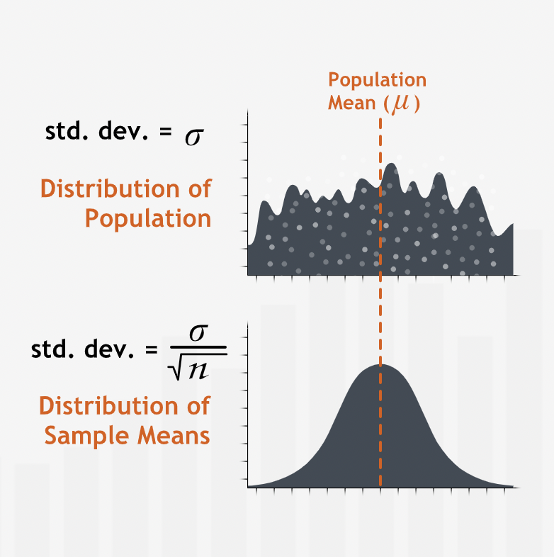

#### Summary

- **"A confidence interval is an estimate for the mean of a population. It specifies a range that is likely to contain the population mean. A confidence interval is centered at the mean of a sample randomly drawn from the population under study. When we have a confidence level of 95% we expect equally wide confidence intervals centered at 95 out of 100 such sample means to contain the population mean."**
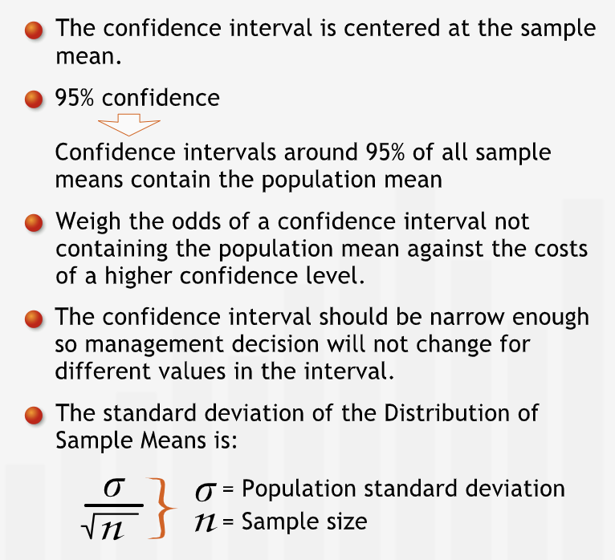

### Finding a Confidence Interval

- Use the confidence formula with appropriate values that can be calculated with the help of earlier discussions.
- For finding the required z with $x\%$ of confidence:
  - Perform $100-x$.
  - The remaining percentage that is obtained should be divided by 2 as we divide the area equally on either sides.
  - Find the $z$ for the cumulative probability of $x+\frac{(100-x)}{2}$ using the table or excel.

#### Summary

- **"To calculate a confidence interval, we take a sample, compute its mean and standard deviation, and then build a range around the sample mean with a specified level of confidence. The confidence level indicates how confident we are that the sample mean we collected contains the population mean."**
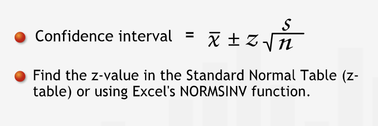

#### Using Small Sample

- **"With a small sample, the consequences of the Central Limit Theorem are not assured, so we cannot be sure that the sample means follow a normal distribution."**
- **"With a small sample, we can't be sure that the sample standard deviation is a good estimate of the population standard deviation."**
- **"Due to these additional uncertainties, we cannot use z-values to construct confidence intervals. Using a z-value would overstate our confidence in our estimate."**
- **"if we don't know anything about the underlying population, we cannot create a confidence interval with fewer than 30 data points. However, if the underlying population is normally distributed — or even roughly normally distributed — we can use a confidence interval to estimate the population mean."**
- For sample whose distribution does not follow normal distribution and the sample size is small, we can use the t-distribution for finding the confidence interval
- A t-distribution gives $t$ values.
- **"A t-distribution gives us t-values in much the same way as a normal distribution gives us z-values."**
- **"A t-distribution looks similar to a normal distribution, but is not as tall in the center and has thicker tails, because it is more likely than the normal distribution to have values fall farther away from the mean."**
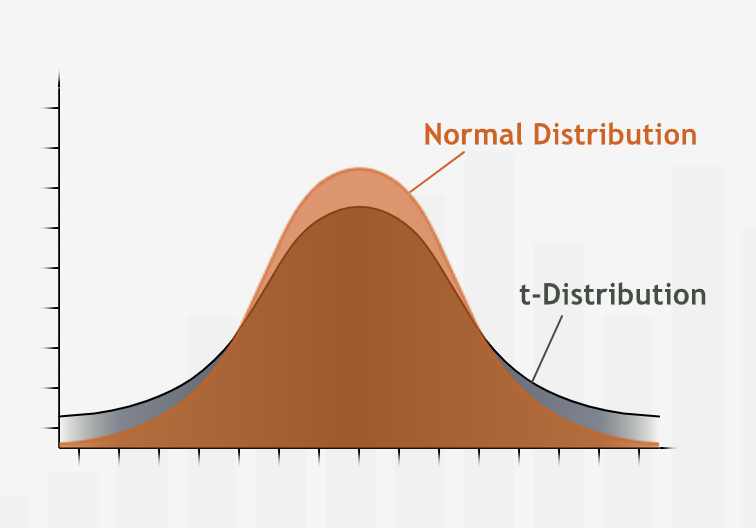
- **"To achieve the same level of confidence, a confidence interval based on a t-distribution will be wider than one based on a normal distribution."**
- **"t-distribution is also different because it varies with the sample size: For each sample size, there is a different t-value associated with a given level of confidence. The smaller the sample size n, the shorter the height and the thicker the tails of the t-distribution curve, and the farther we have to go from the mean to reach a given level of confidence. On the other hand, as the sample size increases, the shape of the t-distribution becomes more and more like the shape of a normal distribution. Once we reach a sample size of 30, the t-distribution becomes virtually identical to the z-distribution, so t-values and z-values can be used interchangeably."**
- t-distribution can also be used for sample size greater than 30 but z-distribution is usually preferred because of ease of calculation.

##### Finding the t value

- To find the t-value - 
  - Find the t-distribution that corresponds to the sample. To find t-distribution.
    - Find the degrees of freedom. Usually it cal be calculated as $(n-1)$.
  - Then use the excel function to find the t-value. Alternatively, use the t-table to find the t-value.
- Use the same formula for confidence interval, just replace $z$ with $t$

##### Summary

- **"Confidence intervals can be constructed even with a sample size of less than 30, as long as the population is roughly normally distributed (or, at least not too skewed or bimodal). To find a confidence interval with a small sample, use a t-distribution. T-distributions are a set of distributions that resemble the normal distribution, but with shorter heights near the mean and thicker tails. To find a confidence interval for a small sample size, place the appropriate t-value into the confidence interval formula."**
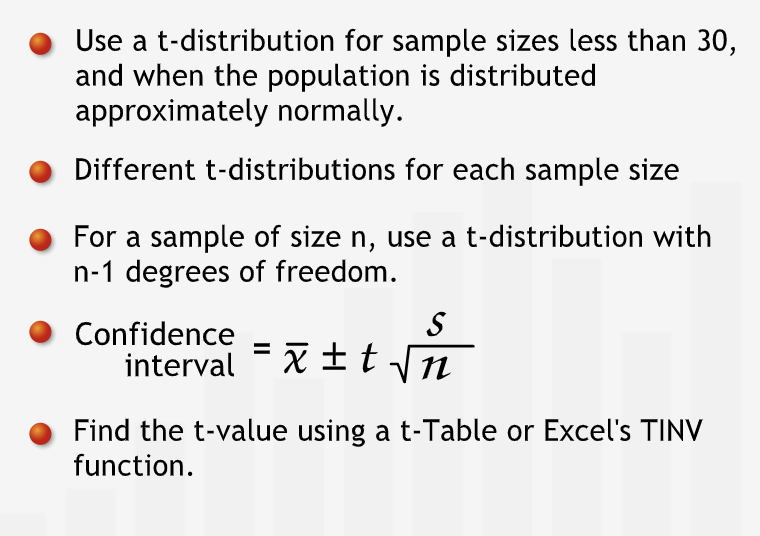

#### Choosing a Sample Size

- Sample size directly affacts the accuracy of the estimate.
- **"The larger the sample size, the tighter the confidence interval and the more accurate our estimate."**
- **"To find the sample size necessary to give us a specified distance d from the mean, we must have an estimate of sigma, the standard deviation of spending. If we do not have an estimate based on past data or some other source, we might take a preliminary survey to obtain a rough estimate of sigma."**
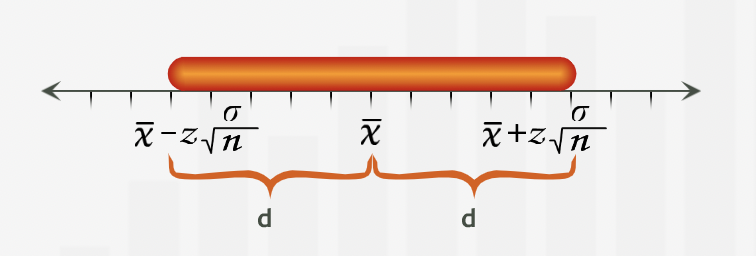

##### Summary

- **"When estimating a population mean, we can ensure that our confidence interval extends a distance of at most d on either side of the mean by choosing an appropriate sample size."**
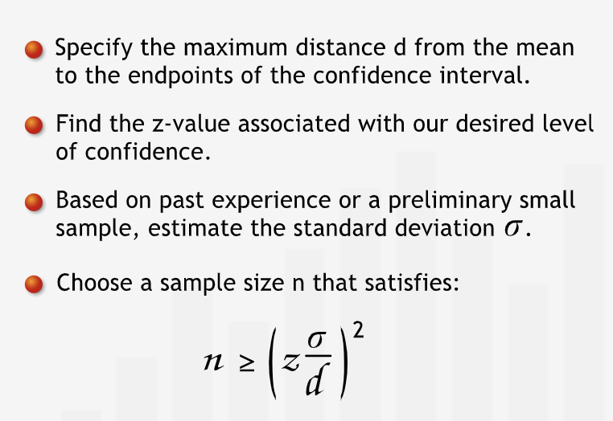

#### Step-by-step Guide

1. **"We choose a level of confidence and a sample size n appropriate to the decision context."**
2. **"We take a random sample and find the sample mean. This is our best estimate for the population mean."**
3. **"We find the standard deviation."**
4. **"Find the z-value or t-value associated with the proper confidence level. If our sample size is over 30, we find the z-value for our confidence level. If not, we find the t-value for our confidence level and with degrees of freedom = sample size - 1."**
5. **"We calculate the end points of the confidence interval using the formulae below."**
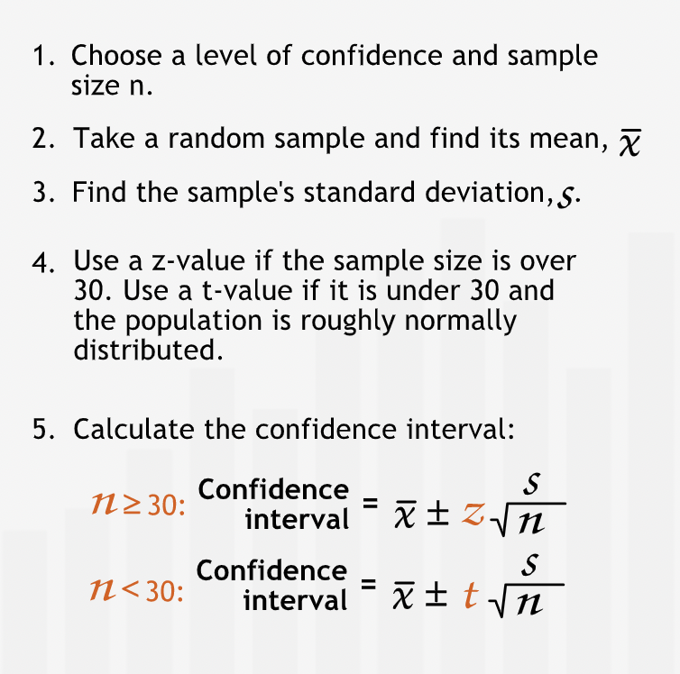

## Proportions

### Confidence Intervals and Proportions

- Proportion is number of desired actions by the total number of actions.
- Proportions for all the actions under consideration always add up to 1.
- Proportion can be considered as a point estimate and we can know confidence interval for this estimate.
- Finding the confidence interval for proportion estimate is similar to the way we discussed earlier. The only difference will be in the calculation of standard deviation. **"We can approximate the standard deviation of the population with a simple formula rather than calculating it directly from the raw data."**
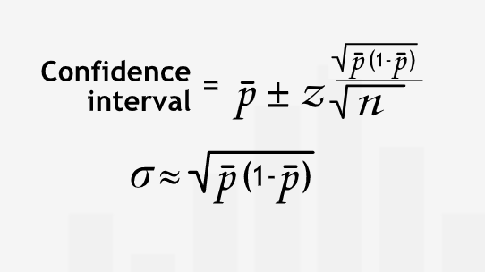

#### Sample Size

- Sample size matters significantly for dealing with very small and very large proportions.
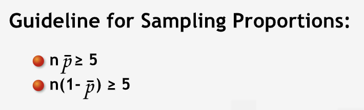
- Guidelines ensures that our sample has reasonable numbers for every action.

#### Finding a Preliminary Estimate of p-bar

- **"We can obtain a preliminary estimate of p-bar using either of two methods: first, we can use past experience. In many cases, however, we are sampling for the first time. Without past experience, we don't know what p-bar might be. In this case, it may well be worth our time to take a small test sample to estimate the proportion, p-bar."**

#### Summary

- **"Proportions are often used to indicate the frequency of some characteristic in a population. The sample proportion p-bar is the number of occurrences of the characteristic in the sample divided by the number of respondents, the sample size. It is our best estimate of the true proportion in the population. We can construct a confidence interval for the population proportion. Two guidelines for the sample size must be met for a valid confidence interval: n(p-bar) and n(1 - (p-bar)) must each be at least five."**
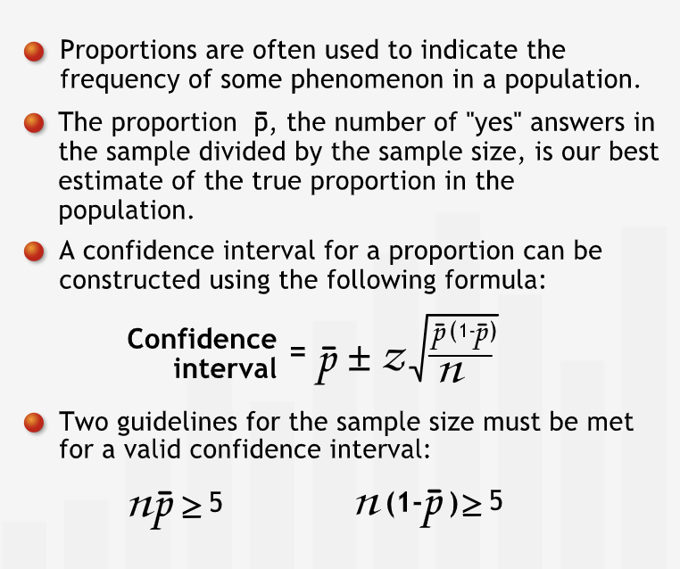

